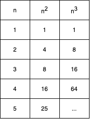
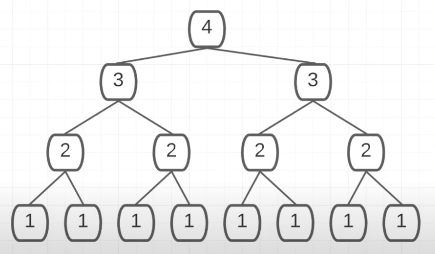

<i>유투브 coderbyte 채널의 [The Complete Guide to Big O Notation & Complexity Analysis for Algorithms](https://www.youtube.com/watch?v=zo7YFqw5hNw)를 듣고 정리</i>

### What is Big O?

Big-O 표기법은 알고리즘의 복잡도를 나타내는 표기법이다. 또한 솔루션 중 어떤 것이 더 적합한지를 가르기 위한 접근 방법이다. 여기서 '적합하다'라는 것의 기준은 프로그램이 소요되는 **시간**과 메모리를 차지하는 **공간** 리소스를 얼마나 적게 차지하냐는 것이다.

### 왜 Big O를 쓸까?

같은 프로그램과 같은 input이 주어진다고 하더라도 구동되는 컴퓨터의 스펙이나 백그라운드에서 작동중인 기타 작업들에 의해 프로그램의 수행 시간은 달라질 수 있다. Big O 표기법은 이런 배경적인 변수요인을 날려버리고 시간적, 공간적 필요요소에 집중한다. Big O는 worst case 시나리오에 대비하기에 적절한 방법이다.

```js
const getAverage = (numbers) => {
  let sum = 0;
  
  for (let i = 0; i < numbers.length; i++) {
    let number = numbers[i];
    sum += number;
  }
  
  return sum / numbers.length;
}

console.log(getAverage([12, 1, 50, 24]));
```

줄 4의 `i < numbers.length` , `i++` , 줄 5, 6의 `let number = numbers[i]` , `sum += number` 에서 연산 과정이 추가되므로 O(4n)이라고 생각할 수 있지만, 빅 오는 인풋의 크기에만 집중하므로 O(4n)이 아닌 O(n)으로 표기한다. (여기서 n은 어레이 인풋의 길이이다)

**인풋의 크기가 달라짐에 따라 알고리즘의 성능에 어떤 변화가 있는지에 집중한다.**

### Product Rule(계수법칙)

n 값에 어떠한 상수가 곱해지더라도 이는 의미를 갖지 않는다. 입력의 크기가 무한에 가까워지는 경우 상수는 별 영향을 끼치지 않기 때문이다.

- O(4 * n) ⇒ O(n)
- O(252n) ⇒ O(n)
- O(n / 5) ⇒ O(n)
- O(4 * n * n) ⇒ O(***n***2)
- O(412) ⇒ O(1)

### Sum Rule(합의 법칙)

연산이 여러 항이 존재한다면 그 중에 가장 큰 항만 남기고 나머지는 무시한다.

- O(n + 1000) ⇒ O(n)
- O(n2 + n) ⇒ O(n2)
- O(n + 500 + n3 + n2) ⇒ O(n3)

### Product Rule + Sum Rule

Sum Rule을 적용하고 Product Rule을 적용하자.

- O(5n2 + 100n + 17) ⇒ O(n2)
- O((n/3)6 + 10n) ⇒ O(n6)

### 시간 복잡도 예제

```jsx
const foo = (n) => {
  for (let i = 0; i < n.length; i++) {
    console.log(i)
  }
  
  for (let j = 0; j < 11; j++) {
    for (let k = 0; k < n; k++) {
      console.log('j ', n, ' k');
    }
  }
}
```

O(n + 11n) ⇒ O(n)

### 공간 복잡도 예제 1

```jsx
const getAverage = (numbers) => {
  let sum = 0;
  
  for (let i = 0; i < numbers.length; i++) {
    let number = numbers[i];
    sum += number;
  }
  
  return sum / numbers.length;
}
```

얼마나 공간을 차지하는지를 판단한다. 변수 지정은 메모리 공간을 소요하므로 위 함수에서 변수로 지정되어있는 `sum` , `number` , `i` 총 3개, 즉 O(3) ⇒ O(1)가 공간복잡도가 된다. (`number` 의 경우 반복될때마다 변수 메모리가 생성되고 사라지고를 반복하기 때문에 상수이다). input으로 주어지는 변수의 갯수를 고려하지 않고 함수가 실행됨에 따라 필요로하는 메모리를 고려해야한다.

### 공간 복잡도 예제 2

```jsx
const doubler = (items) => {
  let newArr = [];
  
  for (let i = 0; i < items.length; i++) {
    newArr.push(items[i])
    newArr.push(items[i])
  }
  return newArr;
}
```

for loop을 돌 때마다 item이 두번 추가된다. 즉, n개의 어레이가 있다면 두번씩 추가되기 때문에 2n, O(2n)이 되고 이는 계수법칙에 따라 O(n)이 된다.

### 재귀 코드 분석

시간, 공간 복잡도와 재귀 코드

```jsx
const zoom = (n) => {
  if (n === 0) {
    return console.log(0)
  }
  
  console.log(n)
  zoom(n - 1);
}

zoom(10)
```

시간 복잡도: O(n), 주어지는 n만큼 재귀 함수를 호출하게 된다.

공간 복잡도: O(n), 함수를 호출하는 데에 n만큼의 스택이 소요된다.

```jsx
const zap = n => {
  if (n < 1) {
    console.log("blastoff!")
    return
  }
  console.log(n)
  zap(n - 2)
}

zap(10);
```

시간 복잡도: O(n/2) ⇒ O(n)

공간 복잡도: O(n/2) ⇒ O(n)


### 총 7단계의 빅오 표기법을 효율적인 순으로 나열해보자.
<br>


#### 1) O(1)

```jsx
const constant = (n) => {
  for (let i = 0; i < 5; i++) {
    console.log(`${n} + 5 = ${n + 5}`)
  }
}
```

어떤 크기의 인풋이든 for loop은 5번에 국한된다. O(5) 이므로 O(1)이라 할 수 있다. 
<br>
<br>

#### 2) O(logN)
로그는 기하 연산의 반대로 기하연산이 반복된 곱셈이라면 로그는 반복된 나눗셈이다.
log2(32) ⇒ 2를 몇 번(x) 곱했을 때 32가 나오는가? 5번이므로 log2(32)의 값은 5이다.
log3(9) ⇒ 3을 2번 곱했을 때 9가 나오므로 값은 2이다.
빅 오 표기법에서 쓰이는 log는 밑이 생략되어있는데, 이는 빅오 표기법에서는 밑을 2로 간주하고 생략하기 때문이다. 

```jsx
const logExample = (n) => {
  while (n > 1) {
    console.log(n);
    n /= 2;
  }
}

// 12
// 6
// 3
// 1.5
// 'done'
```

```jsx
// 같은 함수이지만 재귀로 바꿈
const logExample = (n) => {
  while (n < 1) {
    console.log("done");
    return;
  }
  console.log(n)
  logExample(n / 2)
}
```

<p align="center"></p>

#### 3) O(n)

```jsx
const linear = (arr) => {
  for (let i = 0; i < arr.length; i++) {
    console.log(arr[i] * arr[i])
  }
}
```

인풋값이 증가함에 따라 선형적으로 알고리즘 단계가 증가한다. 원소 하나가 추가되면 알고리즘 단계도 하나씩 늘어난다. 
<br>
<br>
 

#### 4) O(n*log(N)): 선형로그

```jsx
const bar = (str) => {
  console.log(str);
  if (str.length <= 1) return;
  const midIdx = Math.floor(str.length / 2);
  bar(str.slice(0, midIdx));
}

console.log(bar('alskdjflkwjroiwdsfcx'))
```

스트링 값의 중간 인덱스를 찾아서 인풋으로 다시 보내므로 log(N)이 성립하고, `slice` 메서드가 n/2개의 스트링 값을 복사하므로 최종적으로 n * log(N)이 된다.

<p align="center"></p>

<br>
<br>

#### 5) O(n^c)

n은 인풋의 크기이며 c는 상수이다. O(n2)를 포함한다.

```jsx
const foo = (arr) => {
  for (let i = 0; i < arr.length; i++) {
    for (let j = 0; j < arr.length; j++) {
      console.log(arr[i] + "/" + arr[j])
    }
  }
}

console.log(foo(['paella', 'pilaf', 'risotto']))
```

for loop를 두 번 돌고 있어서 O(n2)가 된다.

```jsx
const bar = (str) => {
  if (str.length === 0) return; // basecase
  const firstChar = str[0];
  const rest = str.slice(1);
  console.log(firstChar);
  bar(rest);
}

console.log(bar('hello world'))
```

slice 메서드가 string을 복사하므로 여기서 O(n)이 성립한다. 그리고 재귀 동작에서 n번만큼의 재귀 함수를 호출하므로 O(n2)가 된다.

<p align="center'></p>

#### 6) O(c^n) : 기하급수

n은 인풋의 크기, 즉 가변할 수 있는 숫자이며 c는 상수이다. O(2^n), O(3^n)등이 해당한다.

```jsx
const foo = (n) => {
  if (n === 1) return;
  foo(n - 1);
  foo(n - 1);
}

foo(4)
```

c는 n갯수만큼 곱해진다. 만약 c가 2고 n이 4라면 2 * 2 * 2 * 2 = 16단계가 소요된다.

<p align="center"></p>
<br>

#### 7) O(n!): 팩토리얼

n부터 1까지의 숫자를 모두 더한 결과이다.

n! = (n)(n-1)(n-2)(n-3)...(2)(1)

4! = 4 * 3 * 2 * 1 = 24

```jsx
const foo = (n) => {
  if (n === 1) return;
  
  for (i = 0; i < n; i++) { // 재귀함수 n번 호출
    foo(n - 1);
  }
}

foo(4);
// 4 * 3 * 2 * 1 번 호출
```

<p style="width: 400px; height: 410px; margin: auto;"></p>
<figcaption align="center">
<small>The Complete Guide to Big O Notation & Complexity Analysis for Algorithms</small>
</figcaption>

<br>

<b>재귀 함수에서의 공간복잡도와 시간 복잡도는 항상 같은 것이 아니다</b>

콜스택에서 요구되는 공간은 최대한의 스택 깊이(stack depth)이다. 

```jsx
const foo = (n) => {
  if (n === 1) return;
  foo(n - 1);
  foo(n - 1);
}

foo(4)
```

<p align="center"</p>
<figcaption align="center">
<small>The Complete Guide to Big O Notation & Complexity Analysis for Algorithms</small>
</figcaption>

<br>
<b>함수가 콜 스택에 쌓이는 순서: foo(4) ⇒ foo(3) ⇒ foo(2) ⇒ foo(1)</b>

위 함수의 시간 복잡도는 O(2^n)이다. 하지만 공간 복잡도는 같지 않다. 콜 스택에 쌓이는 함수는 4단계의 depth를 가지고 있으며 여기서 스택이 클리어되고 쌓이기를 반복하고 더 이상 늘어나지 않는다. 즉 O(4) ⇒ O(1)의 복잡도를 지닌다.