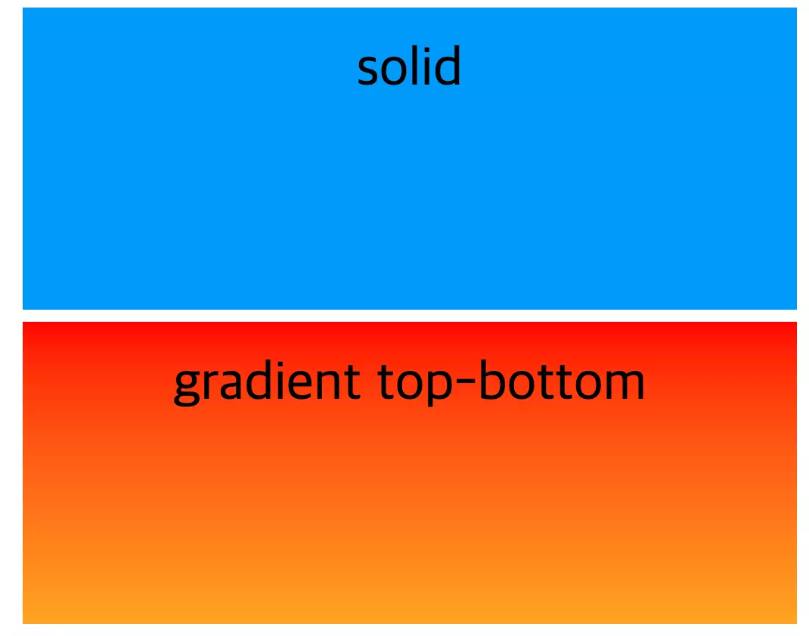
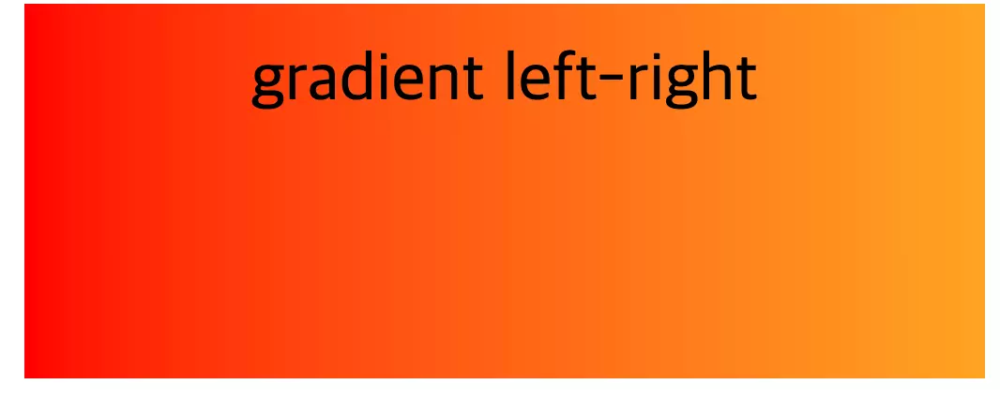
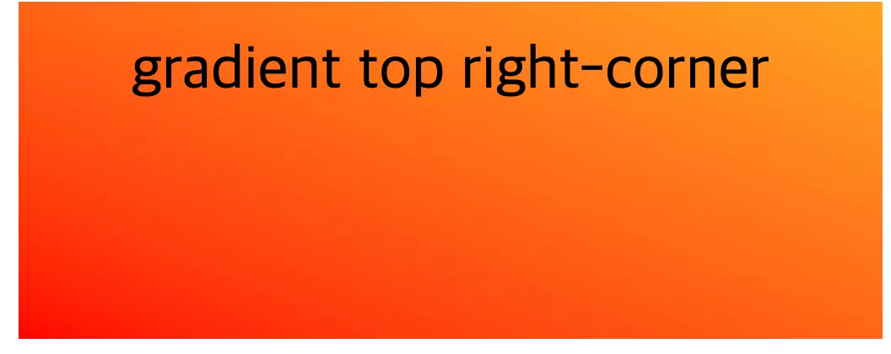
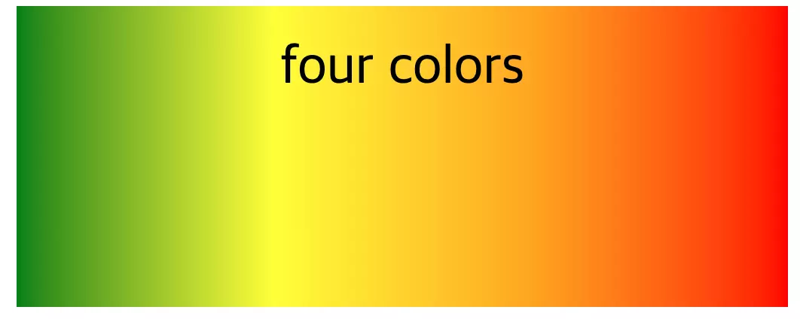
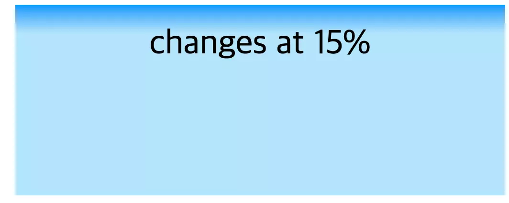
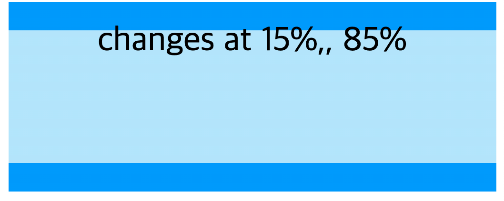
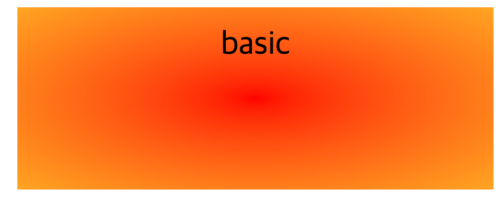
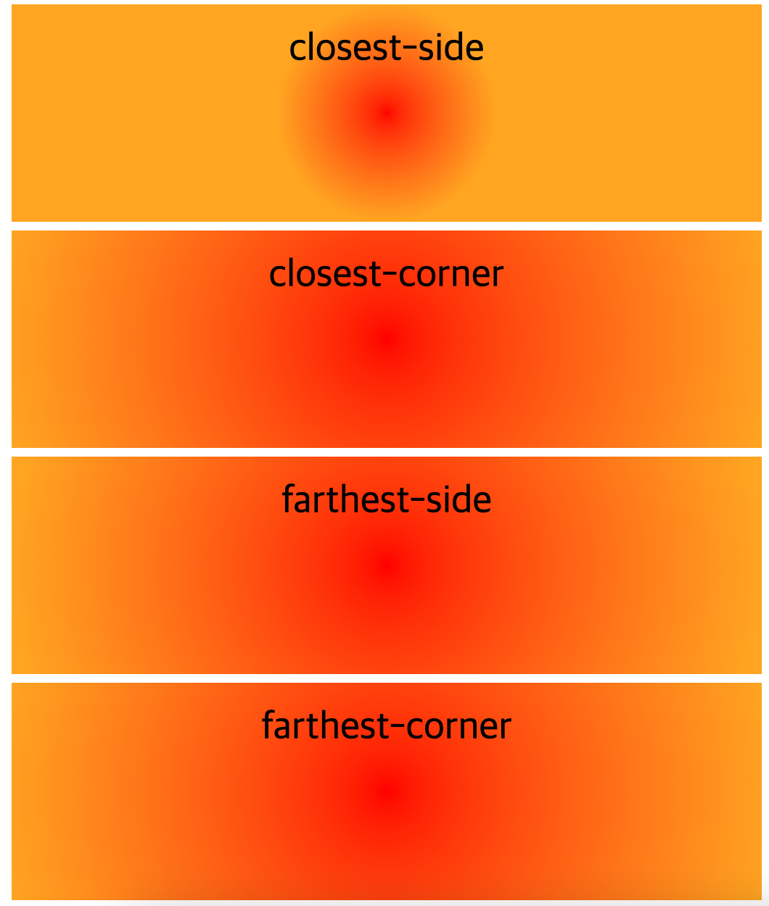
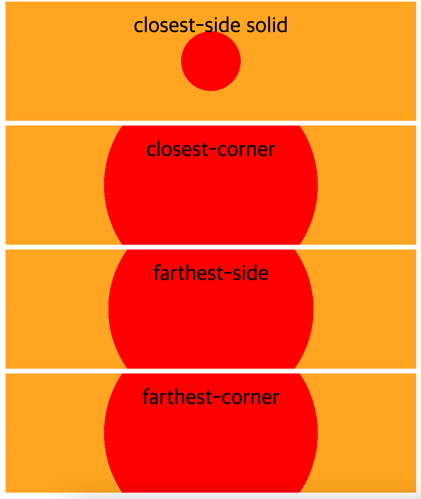
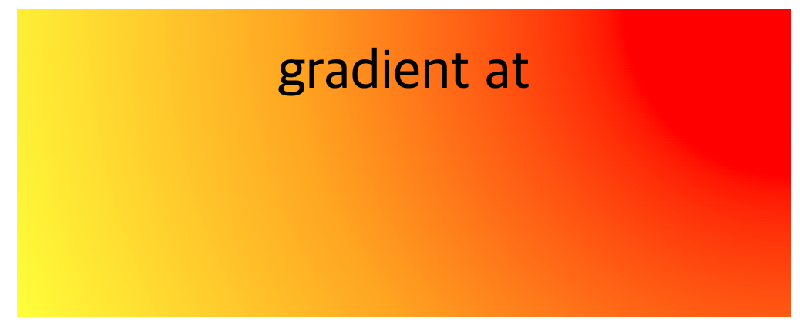

*이 글은 Chris Coyier가 작성한 [CSS Gradients](https://css-tricks.com/css3-gradients/)에서 상당 내용을 참조했습니다*


### CSS의 gradient란 ?

두개 혹은 그 이상의 색상을 가지고 점진적으로 옅게 하거나 진하게 처리하여 이미지를 생성하는 것을 말한다.

**gradient를 적용하는 방법**  
그라디언트를 적용하려면 `background-image` 를 사용한다. (단색을 배경색으로 적용하려면  `background-color` 속성을 사용)

```html
<!DOCTYPE html>
<html lang="en">
  <head>
    <meta charset="UTF-8" />
    <meta name="viewport" content="width=device-width, initial-scale=1.0" />
    <meta http-equiv="X-UA-Compatible" content="ie=edge" />
    <link rel="stylesheet" href="index.css" />
    <title>Gradient</title>
  </head>
  <body>
    <div class="box solid">solid</div>
    <div class="box gradient-top-bottom">
      gradient top-bottom
    </div>
  </body>
</html>
```

```css
* {
  box-sizing: border-box;
  font-size: 1.5rem;
}

html {
  padding: 8px;
}

.box {
  width: 100%;
  padding: 20px;
  text-align: center;
  height: 200px;
  margin: 8px;
}

.solid {
  background-color: #09f;
}

.gradient-top-bottom {
  background-image: linear-gradient(red, orange);
}
```



### Linear Gradient(선형 그래디언트)

선형으로 퍼져나가는 그래디언트의 축을 좌-우 혹은 위-아래 혹은 원하는 어떤 앵글로라도 설정할 수 있다. 기본 값은 위-아래이다. Gradient를 만드는 색상 값은 두 개 이상 사용하며 콤마(,)로 구별한다.

그래디언트를 좌우 축으로 설정하고 싶다면 `to right` 값 혹은 `to left` 값을 설정한다. 신택스는 `to [방향]` 이다.

```html
<!DOCTYPE html>
<html lang="en">
  <head>
    <meta charset="UTF-8" />
    <meta name="viewport" content="width=device-width, initial-scale=1.0" />
    <meta http-equiv="X-UA-Compatible" content="ie=edge" />
    <link rel="stylesheet" href="index.css" />
    <title>Gradient</title>
  </head>
  <body>
    <div class="box solid">solid</div>
    <div class="box gradient-top-bottom">
      gradient top-bottom
    </div>
    <div class="box gradient-to-right">gradient left-right</div>
  </body>
</html>
```

```css
/* other css */

.gradient-to-right {
  background-image: linear-gradient(to right, red, orange);
}
```


만약 방향을 오른쪽 상단 구석 코너로 설정하고 싶으면 `to top right` 으로 설정한다.

```css
.gradient-t-right-corner {
  background-image: linear-gradient(to top right, red, orange);
}
```



두 개의 색에만 국한된 게 아니다. 여러 색깔도 넣을 수 있다.

```html
<div class="box gradient-four-colors">
      four colors
</div>
```

```css
.gradient-four-colors {
  background-image: linear-gradient(to left, red, orange, yellow, green);
}
```



색깔이 영역의 어느 시점에 변화하는지 설정할 수 있다.

```css
.gradient-position {
  background-image: linear-gradient(#09f, #b3e5fc 15%);
}
```



그래디언트를 이미지가 페이드 되는 방식만으로 활용할 수 있는 건 아니다. 단색 처럼 효과를 줘서 깔끔한 효과를 낼 수도 있다.

```css
.gradient-solid {
  background-image: linear-gradient(
    #09f 15%,
    #b3e5fc 15%,
    #b3e5fc 85%,
    #09f 85%
  );
}
```



선형 그래디언트에 대한 코드 보기 👇🏻  
[https://codesandbox.io/s/linear-gradient-pwoqwu?file=/index.html](https://codesandbox.io/s/linear-gradient-pwoqwu?file=/index.html)


### Radial Gradient(원형 그래디언트)

원형 그래디언트는 선형 그래디언트랑 다르게 하나의 지점에서 시작하여 원형으로 바깥쪽으로 퍼져나가는 형태이다.

```html
<!DOCTYPE html>
<html lang="en">
  <head>
    <meta charset="UTF-8" />
    <meta name="viewport" content="width=device-width, initial-scale=1.0" />
    <meta http-equiv="X-UA-Compatible" content="ie=edge" />
    <link rel="stylesheet" href="index.css" />
    <title>Gradient</title>
  </head>
  <body>
    <div class="box basic">basic</div>
  </body>
</html>
```

```css
.basic {
  background-image: radial-gradient(red, orange);
}
```
  

default 값은 영역의 가운데에서 처음 색으로 시작해서 마지막 색으로 변화하며 퍼져나가도록 한다. 그리고 아래 그림처럼 타원형인데, 영역이 원형으로 주어지지 않았기 때문이다. 




```css
.gradient-circle {
  background-image: radial-gradient(circle, red, orange);
}
```


값을 circle로 설정하면 영역의 마지막까지 점진적으로 fading한다. 그래디언트가 끝나는 모양을 조절하고 싶으면 아래의 값들을 활용한다

`closest-corner`: 그래디언트의 중앙에서 가장 가까운 영역의 모서리으로 페이딩한다.  
 `closest-side`: 그래디언트의 중앙에서 가장 가까운 변으로 페이딩한다.  
 `farthest-corner`: 기본값, 그래디언트의 중앙에서 가장 먼 모서리으로 페이딩한다.  
 `farthest-side`: 그래디언트의 중앙에서 가장 먼 변으로 페이딩한다.

```css
.gradient-closest-side {
  background-image: radial-gradient(circle closest-side, red, orange);
}

.gradient-closest-corner {
  background-image: radial-gradient(circle closest-corner, red, orange);
}

.gradient-farthest-side {
  background-image: radial-gradient(circle farthest-side, red, orange);
}

.gradient-farthest-corner {
  background-image: radial-gradient(circle farthest-corner, red, orange);
}
```



페이딩 효과 없이 해당 값들이 어떻게 화면에 나타나는지 알고 싶어서 값들을 조금 수정한 후 적용해보았다.

```css
.gradient-closest-side-solid {
  background-image: radial-gradient(circle closest-side, red 50%, orange 50%);
}

.gradient-closest-corner-solid {
  background-image: radial-gradient(circle closest-corner, red 50%, orange 50%);
}

.gradient-farthest-side-solid {
  background-image: radial-gradient(circle farthest-side, red 50%, orange 50%);
}

.gradient-farthest-corner-solid {
  background-image: radial-gradient(
    circle farthest-corner,
    red 50%,
    orange 50%
  );
}
```



나머지 셋은 비슷하지만 closest-side는 확실히 가장 가까운 변에서 fading이 끝나는 걸 확인할 수 있었고, 나머지 셋 도 value가 뜻하는 바를 어느정도 파악할 수 있었다.

물론 그래디언트가 시작하는 지점을 중심부가 아닌 다른 지점으로 설정할 수도 있다. 

`[eclipse or circle] at [position]`

```css
.gradient-at {
  background-image: radial-gradient(
    circle at top right,
    red 20%,
    orange,
    yellow
  );
}
```



원형 그래디언트에 대한 코드 보기 👇🏻   
[https://codesandbox.io/s/radial-gradient-rvquc6?file=/index.css:1206-1325](https://codesandbox.io/s/radial-gradient-rvquc6?file=/index.css:1206-1325)

CSS Gradient는 브라우저별로 서포트 여부가 갈려서 이 부분에 대해서 잘 알아보고 사용하자!

참고한 글

[https://css-tricks.com/css3-gradients/](https://css-tricks.com/css3-gradients/)  
[https://developer.mozilla.org/en-US/docs/Web/CSS/gradient/radial-gradient()](https://developer.mozilla.org/en-US/docs/Web/CSS/gradient/radial-gradient())  
[https://aboooks.tistory.com/363](https://aboooks.tistory.com/363)