Debugging은 스크립트 내 에러를 검출해 제거하는 일련의 과정을 의미한다. 모던 브라우저와 호스트 환경 대부분은 개발자 도구 안에 UI 형태로 디버깅 툴을 구비해 놓는다. 이러한 디버깅 툴을 활용해서 디버깅을 쉽게 하고 코드가 어떻게 실행되는지 추적할 수 있다.

# 1) 크롬 브라우저에서 제공하는 디버깅 툴 활용하기

### Sources 패널

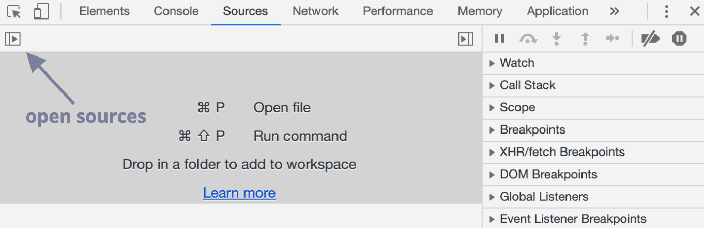

토글 버튼을 누르면 navigator가 열리면서 현재 사이트와 관련된 파일들이 나열된다.

파일 목록에서 hello.js를 클릭하면 아래처럼 화면이 구성된다.

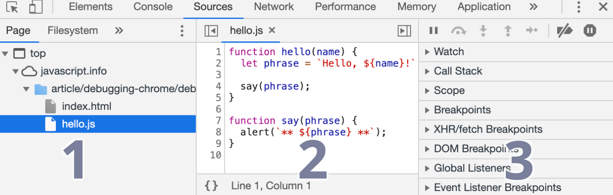

1. 파일 탐색 영역 - 페이지를 구성하는 데 쓰인 모든 리소스(HTML, JavaScript, CSS, 이미지 파일 등)를 보여준다. 구글 익스텐션이 나타날 때도 있다.
2. 코드 에디터 영역 - 리소스 영역에서 선택한 파일의 소스 코드를 보여준다. 여기서 소스 코드를 편집할 수도 있다.
3. 자바스크립트 디버깅 영역 - 디버깅에 관련된 기능을 제공한다. 

### Breakpoint(중단점) 활용하기

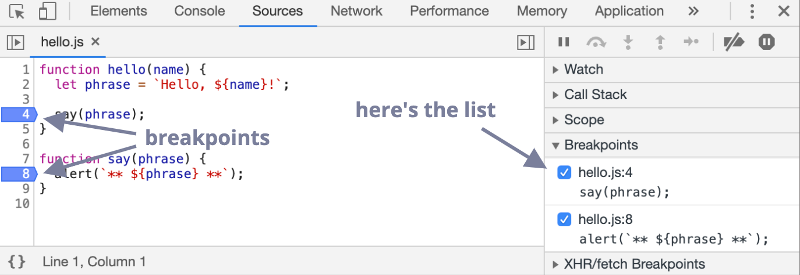

소스 코드 영역에서 검사하고자 하는 영역의 줄 번호를 클릭하면 위처럼 파란색 북마크가 생기면서 breakpoint가 설정된다. 이제 페이지 새로고침을 하면 화면 영역이 opacity가 생기면서 다소 어두워지고 Paused in debugger라는 알림 문구가 생긴 것을 확인할 수 있다.

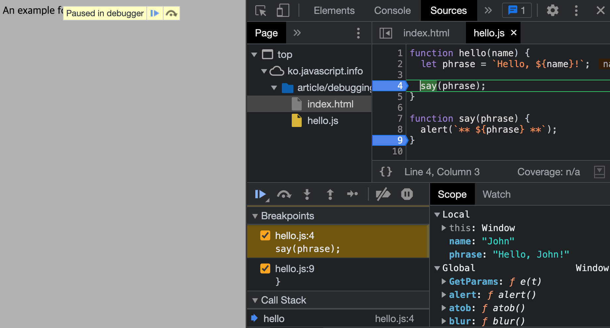

우측 하단의 Scope창에서 현재 시점의 `name` 변수와 `phrase` 변수 값이 무엇인지 나타난다. 실행이 중지된 시점에 변수가 어떤 값을 담고 있는지 확인할 수 있어서 디버깅에 유용하다. 

### debugger 명령어

`debugger` 명령어는 breakpoints와 거의 유사하다고 보면 될 것 같다. 다른 점은 breakpoint는 크롬의 Sources 탭에서 설정하지만 `debugger` 는 스크립트 내에서 코드를 작성해야 한다는 점이다. chrome 개발자도구의 console 창에서 작성할 수도 있고, vscode같은 에디터에서 실행할 수도 있다. 

- chrome devtool에서 실행하기
    
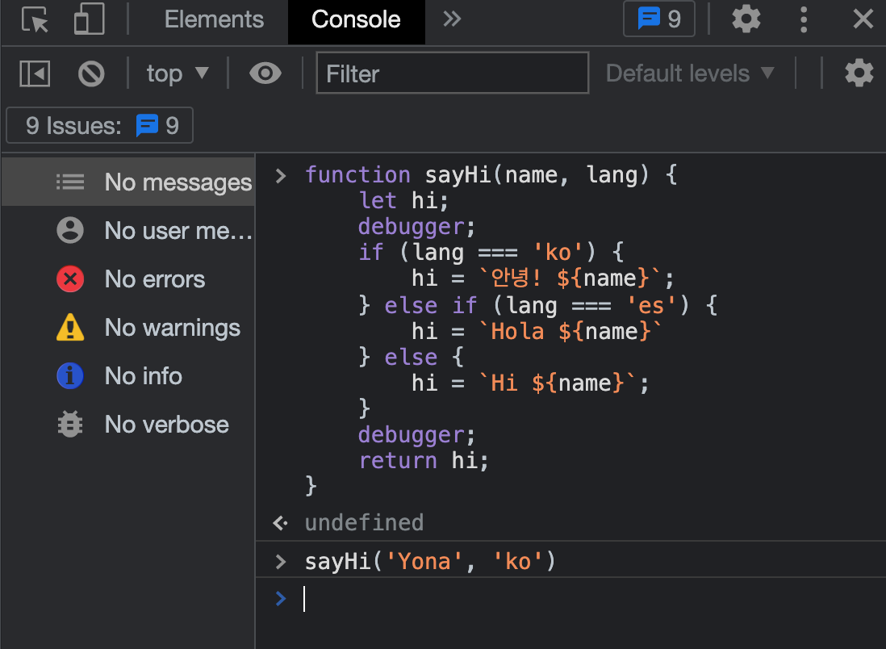
    
크롬 콘솔창에서 `sayHi`라는 함수를 생성하고 실행시킨 모습이다. 함수 안에 두 개의 `debugger` 를 포함하고 함수를 실행시켜보자.

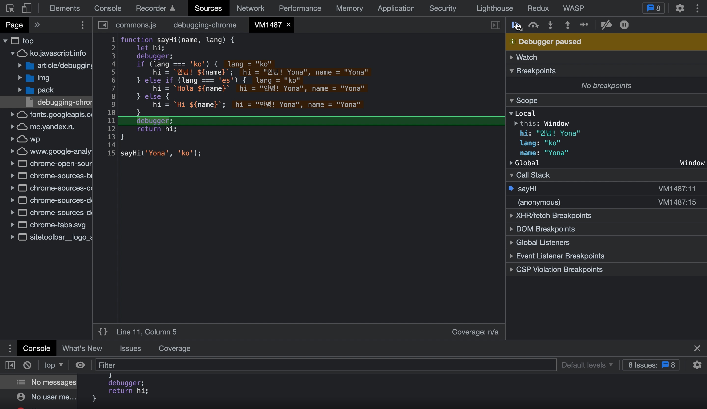

함수가 실행되면서 Sources 탭이 활성화되고 `debugger`가 위치한 곳에서 실행이 멈춘다. 해당 위치의 컨텍스트에 있는 변수들의 값을 확인할 수 있다. breakpoints와 기능적으로 동일하다.

- vs code(IDE)에서 `debugger` 활용하기

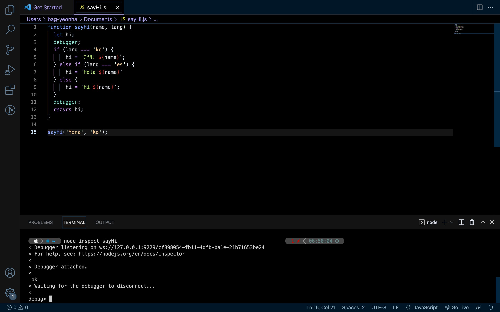

IDE에서 debugger를 실행하기 위해선 우선 

1) 코드를 작성하고 터미널을 연다. 

2) 그 다음 `node inspect [파일명]` 을 입력하면 디버거 모드로 변화한다. 

3) `c` 혹은 `cont` 를 입력하면 `debugger` 명령어를 위치한 곳으로 시점이 옮겨간다.

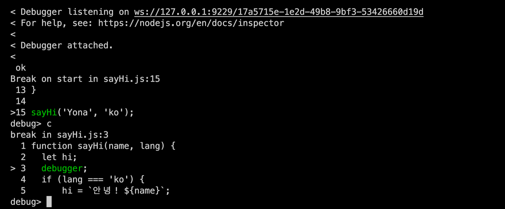

4) 변수 값을 확인하려면 `repl` 을 입력하고 변수명을 입력한다. 그리고 해당 값을 확인한다.

  

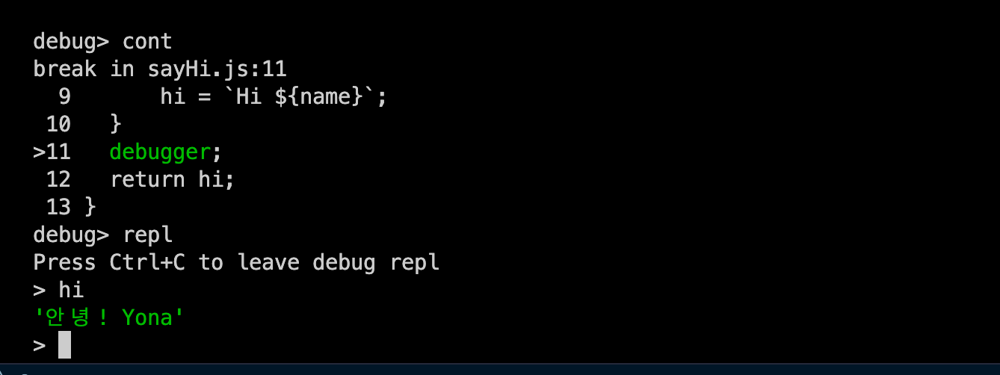

# 2) Postman 활용하기

프론트엔드에서 업무를 하며 사실 가장 많이 사용했던 디버깅 툴은 Postman인 것 같다.

Postman 사이트에 보면 다음과 같이 Postman이 무엇인지에 대한 정의가 나와있다.

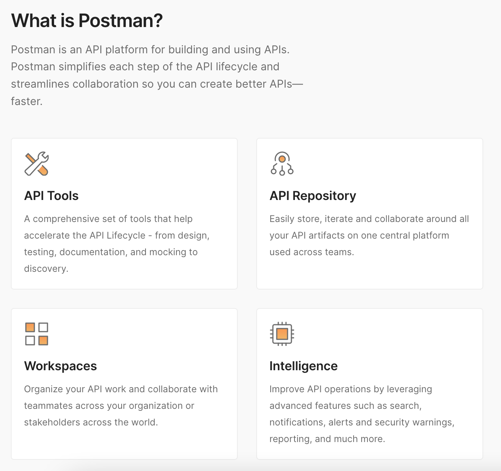

What is Postman? 이라는 질문에 Postman은 API를 설계하고 사용하기 위한 API 플랫폼이라고 답하고 있다. 무료 버젼에서는 사용 가능한 범위가 다소 한정적이지만 사이드 프로젝트의 수준에서 많은 API 호출을 하지 않는다면 무리 없이 이용 가능하다.

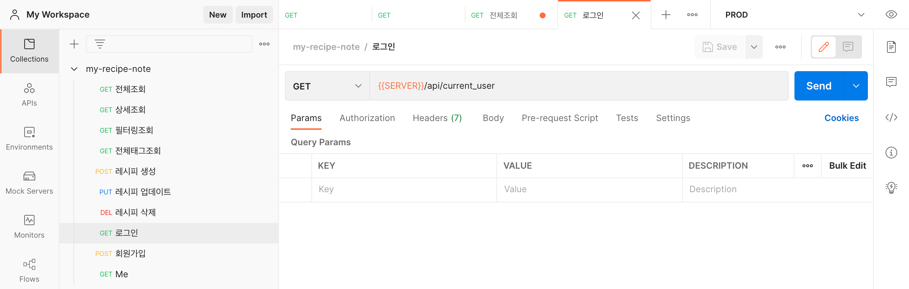

프론트엔드 서버를 가동하지 않고도 API 호출을 할 수 있어서 시간 단축을 할 수 있고 문서화 기능도 뛰어나기 때문에 현업에서도 자주 쓰인다.

협업하는 경우가 아니더라도 매번 API 호출을 하기 위해 코드 에디터를 참조하기 보다 Postman을 활용해서 가독성과 효율성 두 가지 장점을 얻어가기를 추천한다. 

참조
 
[https://ko.javascript.info/debugging-chrome](https://ko.javascript.info/debugging-chrome)
[https://developer.chrome.com/docs/devtools/javascript/breakpoints/](https://developer.chrome.com/docs/devtools/javascript/breakpoints/)
[https://www.postman.com/](https://www.postman.com/)