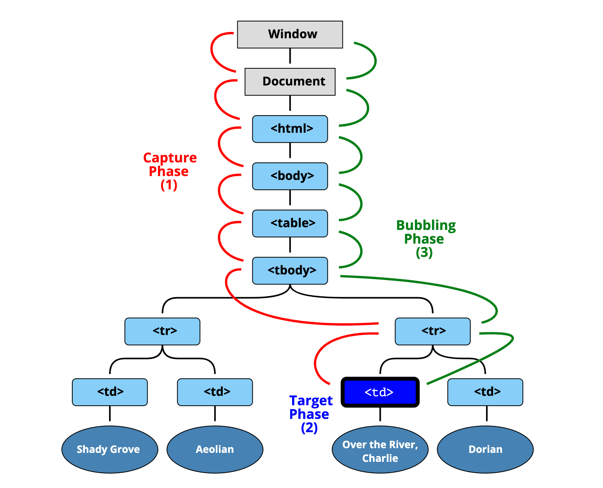

### 이벤트 버블링

Event bubbling은 어떤 엘러먼트에서 이벤트가 발생했을때 해당 엘러먼트의 이벤트 핸들러만 호출되고 끝나는게 아니고 **그 엘러먼트의 부모 엘러먼트가 지닌 이벤트 핸들러까지 호출되는 현상**을 말한다. 이벤트가 DOM 트리를 거품처럼 타고 올라가는 것이다(bubbling up). 이 버블링 현상은 최상단 부모 요소를 만날때까지 지속된다.

### 모든 이벤트에 대해 이벤트 버블링 현상이 발생하는가?

이벤트가 이벤트 버블링 특징을 가지고 있는지 아닌지는 이벤트가 [bubbles 프로퍼티](https://developer.mozilla.org/en-US/docs/Web/API/Event/bubbles)를 가지고 있느냐 그렇지 않느냐에 따라 결정된다. 모든 이벤트가 이벤트 버블링 현상에 속하지는 않는다. 하지만 `focus` 이벤트와 몇몇 이벤트를 제외하고 **거의 모든 이벤트가 버블링**된다.

```html
<style>
  body * {
    margin: 10px;
    border: 1px solid blue;
  }
</style>

<form onclick="alert('form')">
  FORM
  <div onclick="alert('div')">
    DIV
    <button onclick="alert('button')">BUTTON</button>
  </div>
</form>
```

1. `button` 태그에 할당된 onclick 핸들러가 동작한다
2. `div` 태그에 할당된 onclick 핸들러가 동작한다.
3. `form` 태그에 할당된 onclick 핸들러가 동작한다.
4. `document` 객체를 만날 때까지 이벤트 핸들러가 동작한다.

### event.target VS event.currentTarget

event.target은 이벤트가 발생한 바로 그 엘러먼트를 가리킨다. 이벤트가 **어디서** 발생했는지에 대한 정보를 얻을 수 있다.

event.currentTarget(this)는 현재 실행 중인 핸들러가 할당된 요소를 참조한다. 이벤트가 어디서 발생했는지와는 상관없다.

### event.currentTarget 을 비동기 콘솔로 찍었을때 null 이 나오는 이유 ?

[https://codesandbox.io/s/long-rain-p5ml1?file=/src/index.js:0-383](https://codesandbox.io/s/long-rain-p5ml1?file=/src/index.js:0-383)

```jsx
import './styles.css';

const form = document.querySelector('form');

form.onclick = handleClick;

function handleClick(event) {
  event.preventDefault();

  console.log(event.currentTarget); // <form ...>... </form>
  setTimeout(() => {
    console.log('settimeout:', event.currentTarget); // null
    alert('target = ' + event.target.tagName + ', this=' + this.tagName);
  }, 0);
}
```

currentTarget은 이벤트가 핸들링되는 때에만 접근 가능하다. 비동기콜은 task queue에 들어가 있다가 스택에서 호출되는 것이기 때문에 `event.currentTarget`을 잃어버린다.

어떤 경우에 쓰일 수 있나?

이벤트가 발생한 root element를 명확히 하고 싶은 경우, 예를 들어 모달 창에서 모달이 뜨면 백그라운드는 어두워지고 그 백그라운드를 눌렀을때(`click` 이벤트가 발생했을 때) 모달 창을 없애고 싶을 때 사용할 수 있다. `document`에서 `click` 이벤트가 발생했을 시 모달 창을 꺼야 하지만, 모달 창 내부를 클릭했을 때는 모달 창이 꺼지면 안되기 때문이다. 이 경우는 모달 컴포넌트에 `ref`를 걸고 `event.target`이 모달창 내부에 있는 경우를 분기처리한다.

```jsx
import React, { useRef, useState, useEffect } from 'react';
import styled from 'styled-components';
import { ProductList } from '../ProductList';
import { CheerUpProductItem } from '../CheerUpProductItem';
import { useCheerUpProductList } from './useCheerUpProductList';
import { Modal } from '../Modal';

type Props = unknown;

export const CheerUpProductList: React.FC<Props> = (): JSX.Element => {
  const { data } = useCheerUpProductList();
  const ref = useRef<HTMLDivElement>(null);
  const [isOpen, setIsOpen] = useState<boolean>(false);
  const [imgUrl, setImgUrl] = useState<string>('');

  const handleItemClick = (url: string) => {
    setIsOpen(prev => !prev);
    setImgUrl(url);
  };

  useEffect(() => {
    const handleOverlayClick: { (e: MouseEvent): void } = (e: MouseEvent) => {
      const isMobile = window.innerWidth < 1024;
      if (isOpen) {
        if (isMobile) {
          const okayToClose = window.innerHeight - e.clientY > 280;
          if (okayToClose) setIsOpen(prev => !prev);
        } else {
          const node = ref.current; // 모달
          if (!node) return;
          if (node.contains(e.target as Node)) { // 클릭 일어난 지점(e.target)이 모달 내부인경우 무시
            return;
          }
          setIsOpen(prev => !prev);
        }
      }
    };
    document.addEventListener('click', handleOverlayClick);
    return () => {
      document.removeEventListener('click', handleOverlayClick);
    };
  }, [isOpen]);

  return (
    <Container>
      {isOpen && <ModalOverlay />}
      <ProductList>
        {data.map(item => (
          <CheerUpProductItem key={item.id} product={item} onItemClick={handleItemClick} />
        ))}
      </ProductList>
      <Modal ref={ref} isOpen={isOpen} imgUrl={imgUrl} onModalClose={() => setIsOpen(prev => !prev)} />
    </Container>
  );
};

const Container = styled.div`
  background-color: white;
  width: 100%;
  margin: 0px auto;
  min-height: 100vh;
  position: relative;
`;

const ModalOverlay = styled.div`
  position: absolute;
  background: rgba(0, 0, 0, 0.5);
  width: 100%;
  height: 100%;
`;
```

### 이벤트 버블링 멈추기

버블링은 타깃 이벤트에서 시작하여 `document` 객체를 만날때까지 지속된다. 이를 멈추기 위해서는 `event.stopPropagation()` 을 핸들러에게 실행하도록 명령하여 이벤트 버블링을 중단시킬 수 있다.

### event.stopPropagation()과 event.stopImmediatePropagation()의 차이?

`stopPropagation()`을 하면 위쪽으로 이벤트 버블링되는 것이 멈춘다. `click` 이벤트에 따른 이벤트 핸들러 sayHey, sayBye가 있다고 했을때 sayHey에서 `stopPropagation()`을 했다면 이벤트가 버블링되지 않아 상위 이벤트 핸들러는 실행되지 않지만 sayHey는 실행된다. (확인해보기 ⇒ [https://codesandbox.io/s/long-rain-p5ml1?file=/src/index.js](https://codesandbox.io/s/long-rain-p5ml1?file=/src/index.js))

버블링을 멈추고 요소에 할당된 다른 핸들러의 동작도 막으려면 `event.stopImmediatePropagation()`을 사용해야 한다.

```html
<div class="container">
  <h1># stopPropagation</h1>
  <div class="parent">
    <h3>parent</h3>
    <div class="child">
      <h3>child</h3>
      <div class="grand-child">
        <h3>grand child</h3>
      </div>
    </div>
  </div>
</div>
```

```jsx
function sayBye(event) {
  alert(`Bye`);
}

function sayHey(event) {
  alert('Hey');
  event.stopImmediatePropagation(); // event.stopPropagation()과 비교해보기
}
const child = document.querySelector('.child');
const parent = document.querySelector('.parent');
const grandChild = document.querySelector('.grand-child');
grandChild.addEventListener('click', sayHey);
grandChild.addEventListener('click', sayBye);
```

### 이벤트 캡처링

표준 이벤트 흐름엔 3가지 단계가 있다.

1. 캡처링 단계 – 이벤트가 하위 요소로 전파되는 단계
2. 타깃 단계 – 이벤트가 실제 타깃 요소에 전달되는 단계
3. 버블링 단계 – 이벤트가 상위 요소로 전파되는 단계

<figcaption align = "center">https://javascript.info/bubbling-and-capturing</figcaption>

이벤트가 최상위 조상에서 시작해 아래로 전파되고(캡처링 단계), 이벤트가 타깃 요소에 도착해 실행된 후(타깃 단계), 다시 위로 전파된다(버블링 단계). 이런 과정을 통해 요소에 할당된 이벤트 핸들러가 호출된다.

`on<event>` 프로퍼티나 HTML 속성, `addEventListener(event, handler)`를 이용해 할당된 핸들러는 캡처링에 대해 전혀 알지 못한다. 이 핸들러들은 두 번째 혹은 세 번째 단계의 이벤트 흐름(타깃 단계와 버블링 단계)에서만 동작한다.

캡처링 단계에서 이벤트를 잡아내려면 `addEventListener`의 `capture` 옵션을 `true`로 설정해야한다. `capture` 옵션이 `true`이면 핸들러는 캡처링 단계에서 동작하고, `false`이면(디폴트) 버블링 단계에서 동작한다.

```jsx
elem.addEventListener(..., {capture: true})
// 아래처럼 그냥 true 인자만 줘도 같음
elem.addEventListener(..., true)
```
