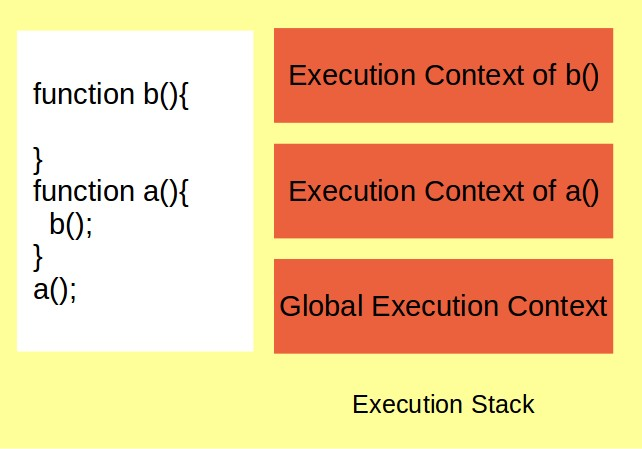

# 실행 문맥

### 실행 문맥(Execution Context)?

간단히 말하면, 실행 문맥은 자바스크립트가 동작하는 환경이다.자바스크립트 변수와 같은 요소들을 저장하는 박스라고 보면 된다. 그리고 이 박스, 즉 실행 문맥 안에서 코드가 읽혀지고 실행된다.

실행 문맥의 디폴트는 Global Execution Context(글로벌 실행 문맥)이다. 글로벌 실행 문맥에서는 함수 바깥에 있는 모든 코드가 실행된다. [지난 스코프 포스팅 참조](https://yeonhapark.github.io/posts/javascript-scope/) 글로벌 실행 문맥은 (브라우저에서 window인)글로벌 오브젝트를 생성한다.

```JavaScript
lastName = window.lastName; // true
```

다시 말해두자. <b>글로벌 실행 문맥은 글로벌 영역에 있는 코드, 함수, 변수만을 실행한다.</b> 그렇다면 로컬 영역에 있는 코드, 즉 함수 내에 있는 코드는 어떡할까? 간단하다. 함수를 실행할 때마다 새로운 실행 컨텍스트가 그 위에 만들어진다.
<p></p>
<figcaption align="center">
<small>
https://medium.com/techracers/execution-context-basics-of-javascript-bb4ef8f1b845
</small>
</figcaption>

글로벌 실행 문맥 위에 새로운 함수가 호출될 때마다 그 함수에 대한 실행 문맥이 생성되고, 함수가 더이상 실행되지 않으면 해당 실행 문맥은 제거된다.

### Execution Context?

실행 컨텍스트가 어떻게 동작하는 지에 대한 답변은 두 가지 국면으로 나눠서 설명할 수 있다.

### Creation Phase(생성 국면)

#### A) 변수 오브젝트의 생성

#### B) 스코프 체인의 형성

#### C) this 값의 정의

### 변수 오브젝트의 생성

실행 컨텍스트의 내부에서는 코드에서 사용되는 변수를 저장하고 관리한다. 이 때 실행 컨텍스트에서 변수 및 함수 선언을 저장하는 객체를 활성 객체(Activation Object) 또는 변수 객체(Variable Object)라고 부른다.

Hoisting개념을 설명하기 전에 자바스크립트에서 함수를 만드는 다른 방식인 함수 선언문(Function Declarations)과 함수 표현식(Function Expressions)에 대해 간단히 짚고 넘어가자.

```javascript
// 함수 선언문: 일반적인 함수 선언 형태
function someFunc() {
  // some logic
}

//함수를 호출할 때
someFunc();

//함수 표현식 : 변수값에 함수를 담아놓은 형태
var hiFunc = function() {
  // some another logic
};
//호출할 때
hiFunc();
```

- 함수 선언문(function declarations)이 작성될 떄 코드가 스캔된다. 그리고 각각의 함수에 대해 변수 객체 안에서 프로퍼티가 생성된다. (즉, 모든 함수는 실행 문맥 안에 저장된다. 함수가 실행도 되기 전에 말이다.) 이 프로퍼티는 함수를 가리킨다.

- 변수 선언문(variable declarations)이 작성될 때 코드가 스캔된다. 변수 객체 내에 프로퍼티가 생성되며 그 값은 undefined로 규정된다.

이 두 가지 경우를 **hoisting**이라고 부른다. 즉, 함수/변수가 선언될 때 코드가 스캔되고 변수 객체 내에 프로퍼티가 생성된다. 그러나 함수와 변수의 호이스팅에는 차이가 존재한다. <b> 함수의 경우, 실행 국면이 채 시작되기 전에 이미 정의된 상태이다. 하지만 변수는 undefined된 상태이며, 실행 국면에 들어가면 그 때 정의될 것이다. </b>

### HOISTING

Hoisting, 한국말로는 '끌어올리기' 라는 뜻 즘으로 해석 할 수 있다. 함수 선언과 함께 코드가 스캔되기 때문에 함수나 변수가 밑에 위치하여도 코드 상 위에 위치해있는 호출구문에서 호출이 가능하다.

```javascript
// HOISTING

calcAge(1999);

function calcAge(year) {
  console.log(2019 - year);
} // 함수의 선언과 함께 변수 객체에 저장됨

retirement(1990); // 에러
// Not a function declaration, but function expression
// 호이스팅은 함수 선언에만 유효하다.
var retirement = function(year) {
  console.log(65 - (2019 - year));
};
```

calcAge는 호이스팅이 되었지만, retirement는 호이스팅이 되지 않았다. 호이스팅은 함수 선언문에만 유효하기 때문이다.
retirement는 anonymous function을 retirement라는 변수에 담아 실행한 함수이다. 이 경우는 함수 선언문(Function Declarations)이 아닌 함수 표현식(Function Expressions)에 해당한다.

```javascript
// 변수 HOISTING

console.log(age); // undefined
// HOISTING은 되지만 값은 undefined이다.

var age = 23;
```

변수를 선언하므로 호이스팅이 되지만, 값은 undefined이므로 undefined가 출력된다.

### B. 스코프 체인의 형성

자바스크립트에서 스코프는 전역 스코프, 로컬 스코프로 나뉜다. 로컬 스포크는 정의된 함수 내의 영역을 일컫는다. 스코프 체인의 순서는 실행 컨텍스트와 반대로 가장 깊은 곳의 스코프부터 글로벌 스코프로 흐른다. (자세한 설명은 지난 번 포스팅에 썼으므로 생략)

```javascript
var a = "one!";
first();
function first() {
  var b = "two!";
  second();

  function second() {
    var c = "three!";
    console.log(a + b + c); // 'one!two!three!'
  }
}
```

### C. this 키워드

this는 모든 실행 컨텍스트가 갖고 있는 변수이다. 그리고 실행컨텍스트 오브젝트에 저장된다. this를 호출할 때, this는 자신의 속한 곳의 오브젝트를 가리킨다. this가 결정되는 원리는 다음과 같다.

- 일반적인 함수 호출(Regular function call): this키워드는 글로벌 오브젝트를 가리킨다.

```javascript
calculateAge(1985);

function calculateAge(year) {
  console.log(2019 - year);
  console.log(this); // Window (regular function call)
}
```

- 메소드 호출(Method call): this는 메소드를 호출하는 객체를 가리킨다. (메소드는 객체에 속해있는 함수이다.)

```javascript
var john = {
  name: "John",
  yearOfBirth: 1989,
  calculateAge: function() {
    console.log(this);
  }
};

john.calculateAge(); // Object {name: "John", yearOfBirth: 1989}
```

this 키워드는 함수가 실제로 실행되기 전까지는 어떤 값을 가지지 않는다. 왜냐하면 함수가 실행되면서 실행 컨텍스트가 스택에 쌓이고, this는 실행 컨텍스트에 종속되어 있기 때문이다.

```javascript
var john = {
  name: "John",
  yearOfBirth: 1989,
  calculateAge: function() {
    console.log(this);
    function innerFunc() {
      console.log(this);
    }
    innerFunc(); // window
  }
};
```

john object를 출력해야 할 것 같지만 window 오브젝트를 반환한다, 메소드 안의 함수라고 하더라도, regular function call 이기 때문이다.

- Method borrowing

```javascript
var john = {
  name: "John",
  yearOfBirth: 1989,
  calculateAge: function() {
    console.log(this);
  }
};

var mike = {
  name: "Mike",
  yearOfBirth: 1984
};

mike.calculateAge = john.calculateAge;
mike.calculateAge(); // mike object
```

어떻게 이게 가능할까? 아까도 말했듯이, this 키워드는 함수/메서드가 호출될 때야 결정되기 때문이다. this키워드가 정적으로(lexically) 결정된다면 mike.calculateAge()를 해도 john이 나왔을 것이다. 그러나 this 키워드는 함수가 실행됨에 따라 동적으로 결정되기 때문에 mike.calculateAge를 호출했을 때 mike object가 반환되는 것이다.
