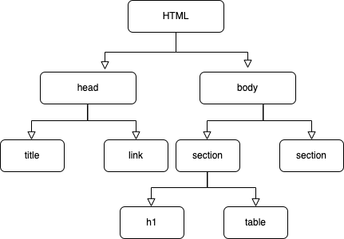

웹페이지가 로드될 때, 웹 클라이언트는 서버에게 리소스(html)파일을 요청하고 서버는 이 리소스를 보낸다.. 웹 클라이언트가 서버에게 리소스를 요청하고 나면 서버는 바이너리 스트림 형식의 텍스트 파일을 응답 헤더의 `Content-Type` 속성에 `text/html; charset=UTF-8` 형식으로 전송한다. 

`text/html` 은 MIME 타입의 일종으로 브라우저에게 html 형식의 문서임을 알려주고 `charset=UTF-8` 은 해당 리소스가 UTF-8 인코딩에 준한다는 것을 알려준다. 이 정보를 활용해 브라우저는 바이너리 형식을 읽을 수 있는 텍스트 파일로 변환한다. 

```jsx
<!DOCTYPE html>
<html>
  <head>
    <title>DOM Rendering</title>
    <meta charset="UTF-8" />
    <link rel="stylesheet" href="./src/styles.css" />
  </head>

  <body>
    <div id="app">
      <div class="container">
        <div>Hello world</div>
        <div>⭐⭐⭐⭐⭐</div>
      </div>
    </div>

    <script src="src/index.js"></script>
  </body>
</html>
```

[https://codesandbox.io/s/confident-yonath-1oxlw?file=/index.html:0-357](https://codesandbox.io/s/confident-yonath-1oxlw?file=/index.html:0-357)

서버의 `Content-Type` 이 브라우저 조건에 알맞으면 이제 브라우저는 HTML 문서를 읽을 준비가 되었다. 하지만 그냥 텍스트 처럼 보이는 HTML 파일이 어떻게 브라우저 상의 화면으로 나타나는 걸까?

### DOM(Document Object Model)

브라우저는 HTML 코드를 읽으면서 모든 HTML 요소들을  `Node` 라고 불리는 자바스크립트 오브젝트로 변환한다. 이런 노드 오브젝트들은 트리 구조로 이루어져 있어서 이전에 생성된 노드 오브젝트를 재사용하는 데에 유리하다. 

<p align="center">
</p>

### CSS Object Model(CSSOM)

DOM 트리를 생성하고 나서 브라우저는 모든 소스에서 CSS를 찾아내어 CSSOM(CSS Object Model)을 형성한다. CSSOM의 경우에는 스크린에 보여지지 않는 `<meta>`, `<script>` , `<title>` 같은 돔 엘러먼트 속성을 포함하지 않는다.

CSS는 html 태그의 style 속성에 넣는 인라인 스타일링, 임베디드, 유저 에이전트 등 다양한 경로에서 소스가 제공된다. 브라우저는 모든 경로의 소스를 아우른 최종 CSS 프로퍼티를 계산하여 노드를 생성한다. CSS가 트리 구조를 가진 속성이라는 것은 스타일링 속성이 상단에 위치한 태그 스타일링을 상속하는 것에서도 알아볼 수 있다. `font-size` 같은 속성이 상위 `<div>` 태그에 적용되어있으면 그 안에 위치하는 `<span>` 태그에서도 동일한 `font-size` 를 상속한다(inherit).

### Render Tree

렌더 트리는 돔 트리와 CSSOM 트리가 합쳐진 트리 구조이다. 브라우저는 화면에 보이는 엘러먼트들의 레이아웃과 스크린에 이를 그리기 위한 계산을 해야 하는데, 이를 위해 렌더 트리를 이용한다. 즉 DOM Tree와 CSSOM 계산은 렌더 트리를 계산하기 위한 선행 과정이며 렌더 트리가 형성되어야만 우리가 원하는 화면을 스크린에 띠울 수 있다. 또한 스크린에 노출되는 형태만 담는 것이기 때문에 픽셀을 차지하지 않는 영역의 노드는 포함하지 않는다. 예를 들어 `display:none;` 속성을 가진 엘러먼트는 렌더 트리에 포함되지 않는다.

요약하면,

브라우저가 HTML 텍스트를 읽고 돔 트리를 형성한다 → 모든 소스에서 가져온 CSS를 읽어서 CSSOM 트리를 형성한다 → 돔 트리와 CSSOM 트리를 가지고 Render-Tree를 형성한다 → Render-Tree를 가지고 엘러먼트를 스크린에 그린다

참고한 글: [https://medium.com/jspoint/how-the-browser-renders-a-web-page-dom-cssom-and-rendering-df10531c9969](https://medium.com/jspoint/how-the-browser-renders-a-web-page-dom-cssom-and-rendering-df10531c9969)