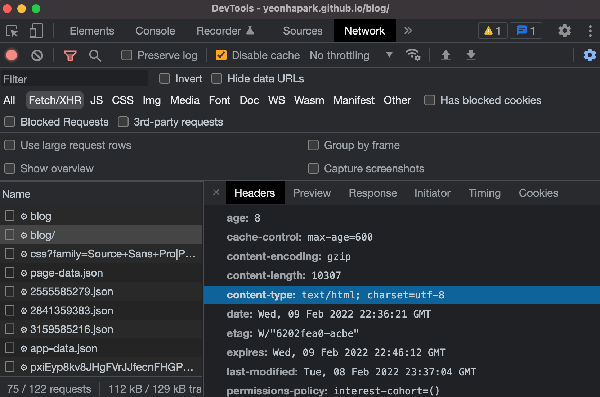
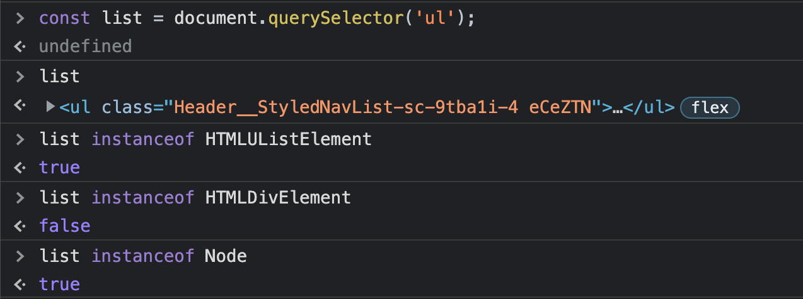
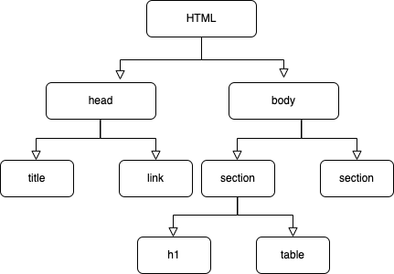

<i>22/02/10에 업데이트 되었습니다.</i>


웹페이지가 로드될 때, 웹 클라이언트는 서버에게 리소스(html)파일을 요청하고 서버는 이 리소스를 보낸다. 웹 클라이언트가 서버에게 리소스를 요청하고 나면 서버는 바이너리 스트림 형식의 텍스트 파일을 응답 헤더의 `Content-Type` 속성에 `text/html; charset=UTF-8` 형식으로 전송한다. 

`text/html` 은 MIME 타입의 일종으로 브라우저에게 자신이 보내는 리소스가 html 형식의 문서임을 알려준다. 그리고 `charset=UTF-8` 은 해당 리소스가 UTF-8 인코딩에 준한다는 것을 알려준다. 이 두가지 정보를 활용해 브라우저는 바이너리 형식을 읽을 수 있는 텍스트 파일로 변환한다. 

<p align="center">
</p>

이렇게 헤더가 명시되지 않으면 브라우저는 파일을 어떻게 다뤄야할지 몰라서 텍스트 형식으로 화면에 나타낸다. 다행히 헤더가 명시된다면 HTML 문서에 대한 변환 작업을 시작한다.

```jsx
<!DOCTYPE html>
<html>
  <head>
    <title>DOM Rendering</title>
    <meta charset="UTF-8" />
    <link rel="stylesheet" href="./src/styles.css" />
  </head>

  <body>
    <div id="app">
      <div class="container">
        <div>Hello world</div>
        <div>⭐⭐⭐⭐⭐</div>
      </div>
    </div>

    <script src="src/index.js"></script>
  </body>
</html>
```

[https://codesandbox.io/s/confident-yonath-1oxlw?file=/index.html:0-357](https://codesandbox.io/s/confident-yonath-1oxlw?file=/index.html:0-357)

이제 브라우저는 HTML 문서를 읽을 준비가 되었다. 하지만 그냥 텍스트 처럼 보이는 HTML 파일이 어떻게 브라우저 상의 화면으로 나타나는 걸까? 이를 이해하기 위해선 DOM, CSSOM, Render Tree라는 세 가지 개념에 대해 알아야 한다.

### DOM(Document Object Model)

브라우저는 HTML 코드를 읽으면서 `html`, `body`, `div` 같은 HTML 요소들을 DOM을 구성하는 기본 요소인 `Node` 라고 불리는 자바스크립트 오브젝트로 변환한다. 

모든 HTML 엘러먼트는 다른 프로퍼티를 지니고 있고 노드 오브젝트는 엘러먼트의 속성에 따라 다른 클래스에서 인스턴스화 된다. 예를 들어, `ul` 태그 요소는 `Node`클래스를 상속 받고 `HTMLUListElement`를 상속받지만 `HTMLDivElement`는 상속받지 않는다.

<p align="center">
</p>

브라우저는 HTML 문서로부터 노드 오브젝트들을 생성하고 나서 오브젝트들을 트리 구조로 발전시킨다. 이렇게 하는 이유는 기존에 생성되었던 트리를 활용하면 중복되는 엘러먼트를 생성해야 할 때 생성과정을 반복할 필요 없이 이전에 생성된 트리를 활용할 수 있기 때문이다.

<p align="center">
</p>

### CSS Object Model(CSSOM)

웹사이트를 만들 때 디자인은 빼놓을 수 없는 요소이다. 개발자는 이를 HTML 요소에 CSS(Cascading Style Sheets)를 적용함으로써 구현한다. CSS 선택자를 이용해서 DOM 엘러먼트에 `background-color`나 `font-size`같은 스타일 프로퍼티 값을 적용한다.

DOM 트리를 생성하고 나서 브라우저는 모든 소스에서 CSS를 찾아내어 CSSOM(CSS Object Model)을 형성한다. 앞서 말한 DOM과 마찬가지로 트리 구조를 갖는다. CSSOM의 경우에는 스크린에 보여지지 않는 `<meta>`, `<script>` , `<title>` 같은 돔 엘러먼트 속성을 포함하지 않는다.

CSS는 html 태그의 style 속성에 넣는 인라인 스타일링, 임베디드, 유저 에이전트 등 다양한 경로에서 소스가 제공된다. 브라우저는 모든 경로의 소스를 아우른 최종 CSS 프로퍼티를 계산하여 노드를 생성한다. CSS가 트리 구조를 가진 속성이라는 것은 스타일링 속성이 상단에 위치한 태그 스타일링을 상속하는 것에서도 알아볼 수 있다. `font-size` 같은 속성이 상위 `<div>` 태그에 적용되어있으면 그 안에 위치하는 `<span>` 태그에서도 동일한 `font-size` 를 상속한다(inherit).

### Render Tree

렌더 트리는 돔 트리와 CSSOM 트리가 합쳐진 트리 구조이다. 브라우저는 화면에 보이는 엘러먼트들의 **레이아웃**과 스크린에 이를 그리기(**페인트**) 위한 계산을 해야 하는데, 이를 위해 렌더 트리를 이용한다. 즉 DOM Tree와 CSSOM 계산은 렌더 트리를 계산하기 위한 선행 과정이며 렌더 트리가 형성되어야만 우리가 원하는 화면을 스크린에 띠울 수 있다. 또한 스크린에 노출되는 형태만 담는 것이기 때문에 픽셀을 차지하지 않는 영역의 노드는 포함하지 않는다. 예를 들어 `display:none;` 속성을 가진 엘러먼트는 렌더 트리에 포함되지 않는다.

DOM 트리와 CSSOM 트리를 생성하고, 렌더링 로직을 핸들링하는 일련의 과정들은 Browser Engine(브라우저 엔진, 렌더링 엔진 혹은 레이아웃 엔진이라고도 불림)이라는 소프트웨어를 통해 이뤄진다. 브라우저 엔진은 HTML 코드로부터 웹 페이지를 렌더링 하기 위한 필수 요소들과 로직을 지니고 있다. 

Webkit이라는 단어에 대해 아마 알고들 있을 것이다. Webkit은 사파리 브라우저가 사용하고 있고 구글 크롬 브라우저의 디폴트 렌더링 엔진이었다. (현재 크롬은 Blink엔진을 사용하고 있음) [여기](https://stackoverflow.com/questions/3468154/what-is-webkit-and-how-is-it-related-to-css/3468311#3468311)를 누르면 현재 브라우저들이 사용중인 엔진을 확인할 수 있다.

요약하면,

브라우저가 HTML 텍스트를 읽고 돔 트리를 형성한다 → 모든 소스에서 가져온 CSS를 읽어서 CSSOM 트리를 형성한다 → 돔 트리와 CSSOM 트리를 가지고 Render-Tree를 형성한다 → Render-Tree를 가지고 엘러먼트를 스크린에 그린다.


### 자바스크립트 파일을 body태그의 하단에 위치시켜야 하는 이유
DOM이 파싱 작업을 하다가 자바스크립트 파일을 만나면 파싱을 중단시키고 스크립트를 실행한다. DOM 파싱 작업은 보통 메인 스레드에서 이뤄지기 때문에 만약 메인 자바스크립트 스레드가 여유가 없으면 DOM 파싱 작업은 해당 스레드에 여유가 생길때까지 연기된다. 이 말은 즉, `script` 엘러먼트는 **parser-blocking(파서 차단)**을 한다는 것이다.
브라우저는 DOM API를 자바스크립트 런타임에 노출시키는데, 즉 자바스크립트 파일에서 DOM 요소를 조작하고 접근할 수 있다는 뜻이다. 자바스크립트 script 실행과 돔 파싱이 평행적으로 일어나게 되면 race condition 조건(Race Condition에 대한 설명은 [여기](https://zangzangs.tistory.com/115?category=458016))에 봉착하기 때문에 돔 파싱 단계가 메인 스레드에서 일어나야 한다.


참고한 글: [https://medium.com/jspoint/how-the-browser-renders-a-web-page-dom-cssom-and-rendering-df10531c9969](https://medium.com/jspoint/how-the-browser-renders-a-web-page-dom-cssom-and-rendering-df10531c9969)