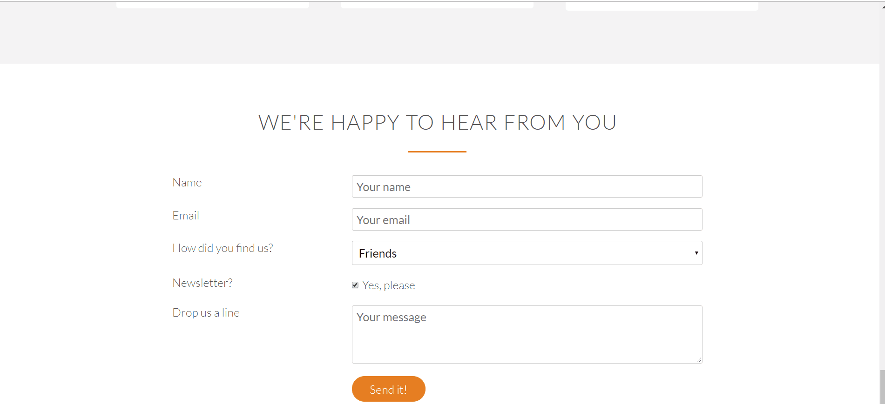

# label 태그의 기능

label 태그는 `<button>, <input>, <meter>, <output>, <progress>, <select>, <textarea>` 태그와 함께 쓰일 수 있으며, 열거된 태그의 라벨링(이름표) 역할을 한다. label 태그를 활용하면 입력란에 직접 마우스를 갖다대지 않고 라벨 부분의 클릭 만으로 입력을 가능하게 하기 때문에 마우스 유저를 위한 경험에 좋다.

아래 영상처럼 input 태그가 있는 범위에 직접 마우스를 클릭하지 않고 name, email 등 label 태그를 클릭하면 마우스 커서가 입력 폼 내에서 깜박이게 된다.
<p></p>

방법은 아래 코드처럼 input 태그에 id 어트리뷰트를 주고, 해당 값을 label의 for 어트리뷰트에 할당한다.

```html
<label for="name">Name</label>
<input id="name" name="name" placeholder="Your name" />
```

### 응용 코드

```html
<form method="post" action="#" class="contact-form">
  <div class="row">
    <div class="col span-1-of-3">
      <label for="name">Name</label>
    </div>
    <div class="col span-2-of-3">
        <input type="text" name="name" id="name" placeholder="Your name" required>
    </div>
  </div>
  <div class="row">
    <div class="col span-1-of-3">
      <label for="name">Email</label>
    </div>
    <div class="col span-2-of-3">
      <input type="text" name="email" id="email" placeholder="Your email" required>
    </div>
  </div>
  <div class="row">
    <div class="col span-1-of-3">
      <label>How did you find us?</label>
    </div>
    <div class="col span-2-of-3">
      <select name="find-us" id="find-us">
        <option value="friends" selected>Friends</option>
        <option value="searchengine">Search Engine</option>
        <option value="ad">Advertisement</option>
        <option value="other">Other</option>
      </select>
    </div>
  </div>
  <div class="row">
    <div class="col span-1-of-3">
      <label>Newsletter?</label>
    </div>
    <div class="col span-2-of-3">
      <input type="checkbox" name="newsletter" id="newsletter" checked>Yes, please
    </div>
  </div>
  <div class="row">
    <div class="col span-1-of-3">
      <label>Drop us a line</label>
    </div>
    <div class="col span-2-of-3">
      <input type="textbox" name="message"  placeholder="Your message" required>
    </div>
  </div>
  <div class="row">
    <div class="col span-1-of-3">
      <label>&nbsp;</label>
    </div>
    <div class="col span-2-of-3">
      <input type="submit" value="Send it!">
    </div>
  </div>
</div>
</form>
```

해당 속성에 대해 학습할 수 있는 링크: [https://developer.mozilla.org/en-US/docs/Web/HTML/Element/label](https://developer.mozilla.org/en-US/docs/Web/HTML/Element/label)

<b>팁: label 태그 내에 input 태그를 넣으면 id, for attribute를 사용하여 연결해주지 않아도 된다. </b>

```html
<label
	>Name
	<input type="text" placeholder="Your name" />
</label>
```
