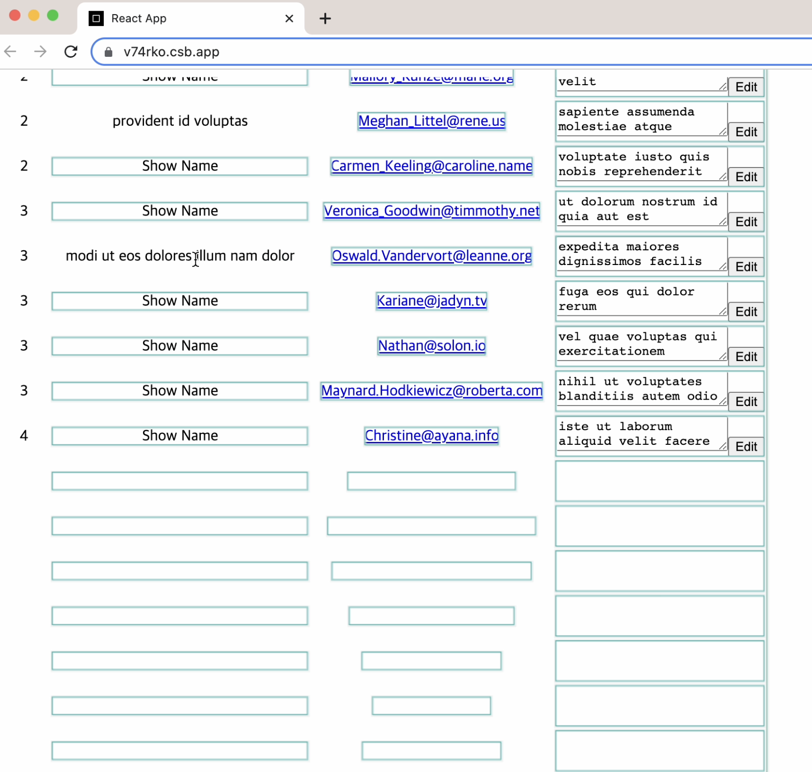
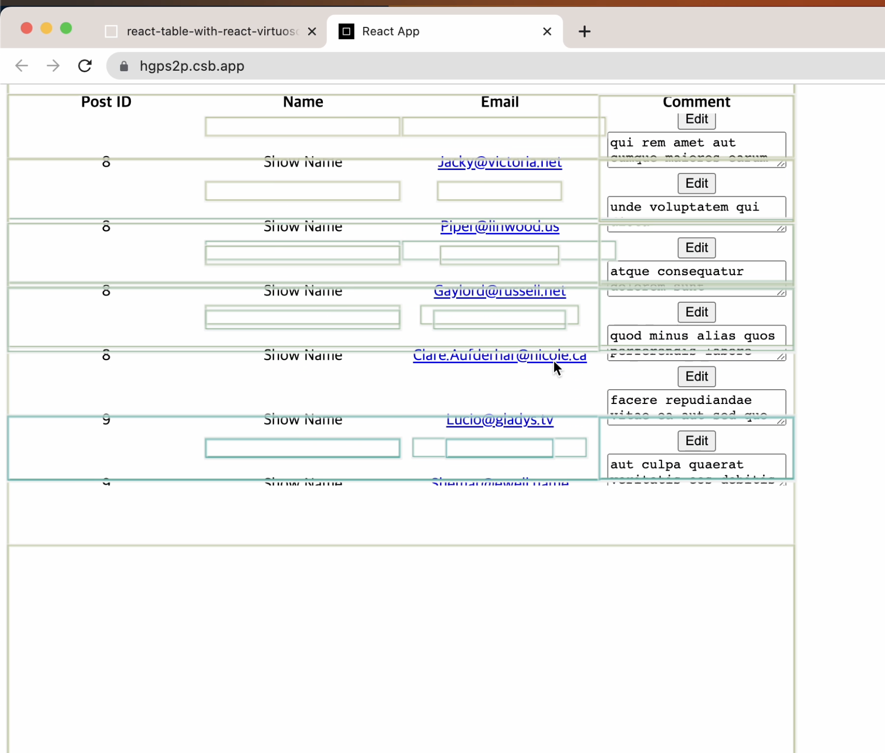

React Table은 Table을 그리는데 필요한 다양한 API와 무엇보다도 useRowSelect를 활용한 행 단위 데이터 선택 기능, 체크박스 기능 등을 제공하고 있어 테이블 상에서 이뤄지는 다양한 작업을 커버하기에 유용한 라이브러리이다.

하지만 업무에서 React Table을 사용하다 보니 단점을 경험하게 되었다. 업무에서는 fetch한 데이터를 다양한 방식으로 가공하여 React Table로 렌더하고, 렌더된 DOM 상에서 사용자가 인터렉션할 수 있도록 여러 기능을 제공하고 있다. 하지만 하나의 테이블에 워낙 많은 기능이 들어가다 보니 일반 사용자가 느끼기에도 현저하게 성능이 저하되는 문제가 발생하였다. 지금 개발중인 프로덕트는 infinite scrolling 방식으로 동작하는데, 첫번째 로드 시 50개 리스트를 불러오고, concat으로 추가 fetch 요청이 발생할 때마다 50개씩 리스트를 덧붙이면서 리스트의 숫자가 매번 fetch가 일어날 때마다 배로 늘어나고, 로드되는 속도는 리스트의 갯수에 비례하여 현저히 느려졌다.

이런 성능 저하에 기여한 요인 중에 상당한 부분이 React Table의 렌더링 방식인데, 사용자가 하나의 셀만 클릭하더라도 테이블을 구성하는 모든 행이 다시 렌더된다. React Table 측에서는 이를 개선해야할 점이라기 보다는 모든 셀을 최신 상태로 유지하기 위해 라이브러리가 선택한 메커니즘으로 설명하고 있다.

https://github.com/TanStack/table/issues/1496

React Table의 작동 방식을 설명하기 위해 codesandbox로 예시를 작성하였다. React devtool의 Profiler 탭에 있는 rerender highlight 기능을 키고 해당 예시를 작동해보자.

https://codesandbox.io/s/react-table-only-v74rko

테이블 공간에 부여한 높이는 400px 이지만 실제 데이터의 숫자만큼 렌더가 되서 노출되지 않는 영역까지 리소스가 소비되고 있다. React-Table에서 column을 구성할 때 Cell 프로퍼티를 사용하여 데이터를 가공한다면 위와 같이 어떤 셀을 조작하더라도 렌더링 대상에 포함된다.

이런 특징 때문에 React Table에서도 react window같은 가상화(Virtualization) 테크닉을 사용하는 것을 홈페이지에 대안으로 제시하기도 하였다. (https://react-table-v7.tanstack.com/docs/examples/virtualized-rows)

목록 가상화: 목록 가상화 혹은 윈도윙(windowing)이라고 불리며 사용자에게 보이는 영역에 한해 리스트를 렌더링하는 테크닉이다.

react-window는 table 태그를 지원하지 않아 react-virtuoso를 대신 사용하였다.

react-virtuoso를 사용하게 되면 style로 입혀준 height 높이에 해당하는 만큼만 렌더가 이뤄지고, 창의 크기를 벗어나면 더이상 렌더되지 않는다. 아이템의 갯수가 1000개, 2000개 넘어가더라도 창의 크기에 해당하는 행의 갯수는 고정이니 대량의 데이터를 렌더링하는 경우에 성능 개선의 효과를 볼 수 있다. 내 경우엔 데이터의 갯수는 아주 많지 않았지만 테이블의 셀(td)마다 다양하고 복잡한 로직과 UI를 지원해야했고 컴팩트한 기능이 들어가다 보니 속도 개선이 필수적인 상황이었다. react-virtuoso를 사용한 가상화로 infinite scrolling으로 인해 리스트가 축적됨에도 페이지가 증가함에 따라 로딩이 현저하게 느려지는 오류를 개선할 수 있었다.

https://codesandbox.io/s/react-table-with-react-virtuoso-hgps2p?file=/src/Table.js

React table, react-virtuoso의 사용방법은 첨부한 codesandbox 링크를 참조

참고자료
https://web.dev/virtualize-long-lists-react-window/