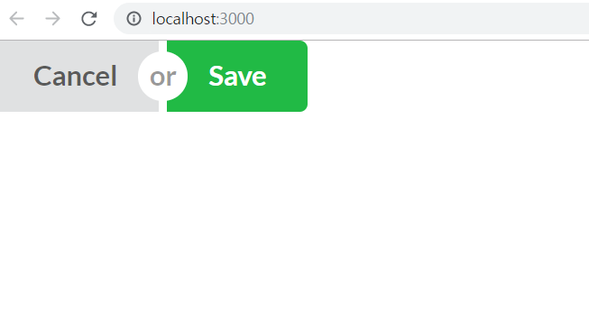

아름다운 UI 컴포넌트들을 사용할 수 있게 도와주는 Semantic UI를 리액트 (create-react-app)상에서 사용하는 방법을 정리해 보았다.

1. 아래 링크로 접속한다.

[https://cdnjs.com/libraries/semantic-ui](https://cdnjs.com/libraries/semantic-ui)

2. [https://cdnjs.cloudflare.com/ajax/libs/semantic-ui/2.4.1/semantic.min.css](https://cdnjs.cloudflare.com/ajax/libs/semantic-ui/2.4.1/semantic.min.css) 를 복사한다.


3. create-react-app으로 시작한 프로젝트의 public 폴더 하단의 index.html로 들어가서, head 태그 내에 해당 css 코드를 추가해준다.

```html
<!DOCTYPE html>
<html lang="en">
	<head>
		<meta charset="utf-8" />
		<link rel="shortcut icon" href="%PUBLIC_URL%/favicon.ico" />
		<meta name="viewport" content="width=device-width, initial-scale=1" />
		<meta name="theme-color" content="#000000" />
		<link
			rel="stylesheet"
			href="https://cdnjs.cloudflare.com/ajax/libs/semantic-ui/2.4.1/semantic.min.css"
		/>

		...
	</head>
</html>
```

4. 이제 semantic ui를 사용할 수 있다. 홈페이지로 접속해서 원하는 컴포넌트 or 아이콘 코드를 복사해서 사용하면 끝! <br>

<활용예제>

```jsx
import React from "react";

const Button = () => {
	return (
		<div class="ui buttons">
			<button class="ui button">Cancel</button>
			<div class="or" />
			<button class="ui positive button">Save</button>
		</div>
	);
};

export default Button;
```


