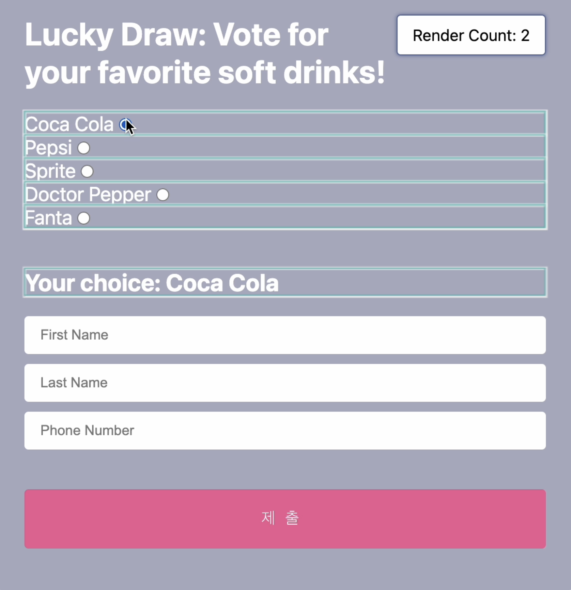

나는 다양한 종류의 input, select 태그를 포함한 form을 다루는 일을 하고 있고, 많은 개발자들이 그렇듯 react-hook-form 라이브러리를 아주 감사하면서 사용하고 있다. React-hook-form의 장점은 ref 기반으로 작동하기 때문에 매번 리렌더링을 야기하지 않아 준수한 성능과 매끄러운 사용자 경험을 제공할 수 있다는 것이다. 안타깝게도 input A 와 input B 의 입력이 발생할 때마다 A x B 의 결과 C를 input C에 넣어줘야 한다면 ref만으로는 이들을 트래킹 할 수 없고 감시를 하거나 onChange가 발생할 때마다 로직을 수행해 주어야 한다. (이하로는 input, select, textarea 등 태그들을 input 요소로 통칭하겠다)

watch API는 특정 name에 해당하는 요소를 인터렉션이 일어나는 때마다 감시하며, 리액트 유저는 이 요소들을 useEffect에 dependencies로 의존성을 줘서 사용자 입력에 따라 반응하여 정보를 업데이트하고 리렌더를 촉발시킨다. 문제는 이 watch가 어떤 input 요소이건 간에 변화가 발생하면 해당 watch가 쓰이고 있는 form의 영역의 모든 아이템에 대해 re-render를 한다는 점이다;. 한 화면에 수십개의 input text, checkbox가 있다면,, 사용자가 인풋 란에 타자를 칠 때마다 수십개의 인풋 요소들이 리렌더링이 된다면 굳이 개발자도구를 켜고 성능을 측정하지 않아도 이미 애플리케이션의 반응 속도는 충분히 느리다는 것을 서글프게 깨달을 수 있을 것이다. (일반적으로 하나의 키보드 입력 이벤트에 50ms 이상이 소요된다면 객관적으로 이를 느리다고 판단할 수 있다.) 

[watch API](https://react-hook-form.com/docs/useform/watch)

### 대안은 useWatch
만약 당신의 서비스가 한 페이지에 수십개 이상의 input 요소들을 포함하고 있다면 useWatch를 사용하여 골치아픈 리렌더링 문제를 축소할 수 있다. useWatch와 watch는 동작하는 기능은 동일하다. 다만 useWatch는 컴포넌트 단위로 리렌더링을 촉발시키기 때문에 전체 Form이 리렌더링되는 현상에 따른 성능 개선 효과를 크게 볼 수 있다. 조금 달라지는 syntax는 아래를 참고하길 바란다. 


```js
const firstName = watch('firstName')

const [strawberry, banana, apple] = watch(['strawberry', 'banana', 'apple'])
```

```js
const firstName = useWatch({name: 'firstName'})

const [strawberry, banana, apple] = useWatch({name: ['strawberry', 'banana', 'apple']})
```

watch 사용시, 아래처럼 form에 해당되는 영역이 모두 리렌더되며 하이라이트 되지만, useWatch를 사용하게 되면 useWatch가 사용되고 있는 일부 컴포넌트에 한해 리렌더가 발생한다. 




[CodeSandbox](https://codesandbox.io/s/react-hook-form-performance-improvement-rhz425?file=/src/PersonalInfo.js) 에서 확인하기

While several teammates are working on the same page and components, watch API provided easier way to track and trigger inputs. However, watch triggers the entire inputs sharing same FormProvider.
Our page wasn't atomic and some input components were made with some unrecognizable name and unused props, mostly added by each developer fixing bug or added small functions week by week.


### onChange Callback
성능을 개선하기 위해 useWatch만 방법이 있는게 아니다. useWatch는 컴포넌트 레벨에서 리렌더링이 이뤄진다는 점만 watch와 다를 뿐, 유효 범위의 모든 input 요소들에 대해 리렌더링을 촉발시킨다는 것은 동일하다. 사실 제일 바람직한 것은 사용자의 인터렉션이 일어나는 input 요소에 한해서만 리렌더링이 발생하거나, 아예 리렌더링을 발생시키지 않는 것이다. [register](https://react-hook-form.com/docs/useform/register) API에서 제공하는 onChange 콜백 함수는 change 이벤트를 구독할 수 있게 하는 기능인데 이를 이용하면 렌더링을 야기하지 않으면서 setValue를 통해 다른 인풋 요소에도 값을 부여할 수 있다. 

<div align="center">
<video width="600" height="560" controls>
  <source src="../../static/media/blog/hookform-watch/norender.mov" type="video/mp4">
</video>
<figcaption align="center">
<small>select요소의 change 이벤트에도 렌더되지 않는다.</small>
</div>
</figcaption>

결과적으로 불필요한 watch는 모두 register API의 onChange 콜백 혹은 Controller 상의 onChange로 동작하도록 리팩토링하고, 여러 디펜던시를 이용하여 복잡한 컴포넌트 제어를 해야해서 불가피하게 watch를 사용해야 하는 곳은 useWatch로 바꿈으로서 인터렉션 성능의 50% 넘게 최적화를 달성할 수 있었다. 늘 시간 없이 개발하는 것도 사실이지만, 내 서비스를 사용하는 유저는 그걸 감안해주지 않는다. 코드를 작성할 때 내가 사용하는 함수가 혹은 어떤 라이브러리의 API가 적어도 어떤 방식으로 동작하는지 숙지하고 사용해야겠다. 

References
<br />
[React Hook Form](https://react-hook-form.com/docs/useform/watch)  
[Optimize Long Tasks](https://web.dev/optimize-long-tasks/?utm_source=devtools)  
