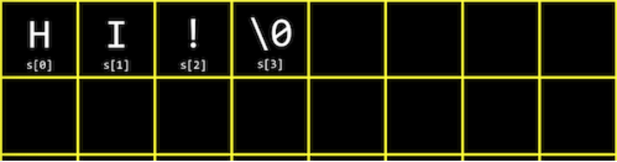

### 컴파일링

C언어 상에서 `make` 나 `clang` 같은 명령어를 실행할 때 컴퓨터는 다음과 같은 과정을 거친다.

- preprocessing (전처리과정)
- compiling (컴파일)
- assembling (어셈블)
- linking (링크)

1. preprocessing

컴파일의 첫번째 과정인 전처리 과정은 전처리기에 의해 수행된다. #으로 시작되는 C 소스 코드는 전처리기에게 실질적인 컴파일이 이루어지기 전에 무언가를 실행하라고 알려준다.

```c
#include <cs50.h>
#include <stdio.h>

int main(void)
{
	string name = get_string("What's/ your name?\n");
	printf("Hello, %s\n", name);
}
```

예를 들어 위 소스코드에서 #으로 시작하는 위의 두 줄을 포함하게 되면 stdio.h, cs50.h의 파일 내용이 #include 부분에 포함된다.

`clang` 은 실제로 <cs50.h> 파일 안으로 들어가 관련되는 코드를 가져와서 내 파일 안에 붙여넣는다.

```c
string get_string(string prompt);
int printf(string format, ...);
//string format 말고도 다른 메서드도 가져옴

int main(void)
{
	string name = get_string("What's/ your name?\n");
	printf("Hello, %s\n", name);
}
```

2. 컴파일링

컴파일링은 소스 코드를 저수준 언어인 어셈블리 코드로 바꾸는 단계이다. (C언어 → 어셈블리 코드)

3. 어셈블링

어셈블링은 어셈블리 코드를 0과 1로 이루어진 머신 코드로 바꾼다.

4. 링킹(연결)

프로그램이 cs50.h, stdio.h처럼 여러 개의 파일을 포함한다면 이를 하나의 오브젝트 파일로 합치는 연결 단계가 필요하다. 개발자가 컴파일 명령어인 `clang` 을 실행할 때 세 개의 파일을 모두 연결되어 hello같은 큰 파일을 이루어준다.

이러한 preprocessing, compiling, assembling, linking 네 가지 단계를 모두 통틀어 **컴파일링**한다고 한다.

### 배열

우리가 특정 자료형의 변수를 선언하면 이는 메모리상 어딘가에 특정 크기만큼의 자리를 차지하게 된다.

C에는 다음과 같은 자료형이 있고, 각각의 자료형은 서로 다른 크기의 메모리를 차지한다.

- bool: 1 byte
- char: 1 byte
- int: 4 byte
- float: 4byte
- long: 8 byte
- double: 8 byte

HI!라는 문자열을 출력하고 싶다면 아래와 같은 코드를 작성할 수 있다.

```c
# include <stdio.h>

int main(void)
{
    char c1 = 'H';
    char c2 = 'I';
    char c3 = '!';
    printf("%c%c%c\n", c1, c2, c3); // HI!
}
```

이렇게 알파벳으로 나타나는 문자도 결국에는 숫자이다. 따라서 형변환(casting)을 통해 아래처럼 나타낼 수도 있다.

```c
# include <stdio.h>

int main(void)
{
    char c1 = 'H';
    char c2 = 'I';
    char c3 = '!';
    printf("%i%i%i\n", (int)c1,(int) c2,(int) c3); // 727333
}
```

72, 73, 33은 각각 H, I, !의 ASCII코드이다.
(ASCII 코드에 대한 설명: [https://en.wikipedia.org/wiki/ASCII](https://en.wikipedia.org/wiki/ASCII))

반대로 아래처럼 정수를 char형으로 변환해서 표현할 수도 있다. 대문자 ASCII코드에 32를 더하면 소문자가 되는데, 아래에서는 이를 이용하여 대문자를 자로 변환해주었다.

```c
# include <stdio.h>

int main(void)
{
    int c1 = 72;
    int c2 = 73;
    int c3 = 33;
    printf("%c%c%c\n", (char)c1 + 32,(char) c2 + 32,(char) c3);
		// hi!
}
```

C에서는 여러 개의 값을 지닌 하나의 변수를 나타내고자 할 때 배열이라고 하는 자료 구조를 사용한다. 배열 안에는 자료형이 같은 값들이 리스트의 형태로 저장된다.

```c
#include <stdio.h>

int main(void)
{
	int scores[3];
	scores[0] = 72;
	scores[1] = 73;
	scores[2] = 33;

	printf("Average: %i\n", (scores[0] + scores[1] + scores[2]) / 3);
}
```

조금 더 확장성을 생각한다면 아래처럼 코드를 발전시킬 수 있다.

```c
#include <stdio.h>
#include <cs50.h>

float average(int length, int array[]);

int main(void) {
		// get_int 함수로 배열의 크기 받아오기
    int n = get_int("Scores: ");
    int scores[n];
		// 각 배열의 위치에 점수 배정하기
    for (int i = 0; i < n; i++) {
        scores[i] = get_int("Score %i: ", i + 1);
    }
    printf("Average: %f\n", average(n, scores));
}

// 평균을 구하는 함수
float average(int length, int array[]) {
    int sum = 0;
    for (int i = 0; i < length; i++)
    {
        sum += array[i];
    }
    return (float) sum / (float) length;
}
```

### 문자열과 배열

지금까지 사용한 문자열(string) 자료형의 데이터는 사실 문자(char) 자료형의 데이터들의 배열이었다. `string s = "HI!";` 와 같이 문자열 s가 정의되어 있다고 생각해보자. s는 문자의 배열이기 때문에 메모리 상에 아래 그림과 같이 저장되고, 인덱스로 각 문자에 접근할 수 있다. 여기서 \0은 문자열의 끝을 나타내는 널 종단 문자이다. 단순히 모든 비트가 0인 1바이트를 의미한다.

널 종단 문자를 넣는 이유는 해당 문자를 넣음으로써 메모리 상에 다른 변수가 삽입될 때 그 변수의 시작점을 이전 변수와 비교해야 하기 때문이다.



### 문자열의 활용

이제 문자열을 더 깊이 활용하는 방법을 알아보자.

문자열은 곧 배열이므로 for loop으로 문자열의 문자를 하나씩 출력해보고자 한다.

```c
#include <cs50.h>
#include <stdio.h>
#include <string.h>

int main(void)
{
	string s = get_string("Input: ");
	printf("Output: ");
	for (int i = 0; n = strlen(s); i < n; i++)
	{
		printf("%c", s[i]);
	}
	printf("\n");
}
```

`strlen` 함수는 string.h 헤더 파일에서 제공하는 함수로, 스트링 배열의 길이를 제공한다. for 루프 내에서 스트링 배열을 인덱싱하며 i 인덱스에 해당하는 char값을 출력한다.

아래와 같은 결과가 나온다.

```bash
~/ $ ./string
Input: EMMA
Output: EMMA
```

### 명령행 인자(command-line arguments)

```c
// 파일명 argv.c
#include <cs50.h>
#include <stdio.h>

int main(int argc, string argv[])
{
    if (argc == 2)
    {
        printf("hello, %s\n", argv[1]);
    } else
    {
        printf("hello, world\n");
    }
}
```

위 main함수는 첫번째 인자로 정수형의 argc라는 변수를, 두번째 인자는 스트링형의 argv 배열 값을 받는다. 여기서 첫번째 변수 argc는 main함수가 받게 될 입력의 개수이다. argv[]는 그 입력이 포함되어 있는 배열이다.

argv[0]는 기본적으로 프로그램의 이름으로 저장된다. 만약 하나의 입력이 더 주어진다면 argv[1]에 저장될 것이다. 따라서 위 프로그램을 실행하기 위해 커맨드 라인에 `make argv` 를 쳐서 컴파일하고 `./argv` 를 실행하면 "hello, world"가 출력될 것이다. 하지만 `./argv Yeonha` 라고 실행하면 "hello, Yeonha"라는 값이 출력된다.
