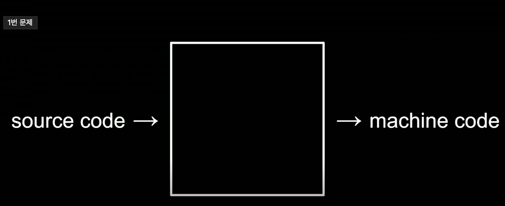
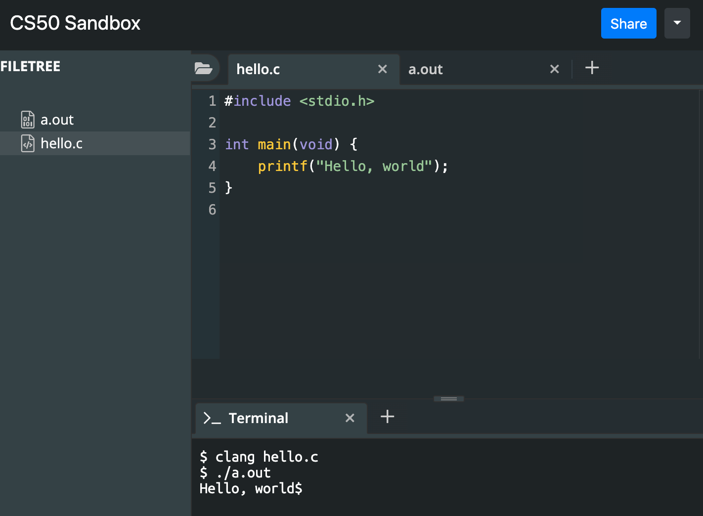
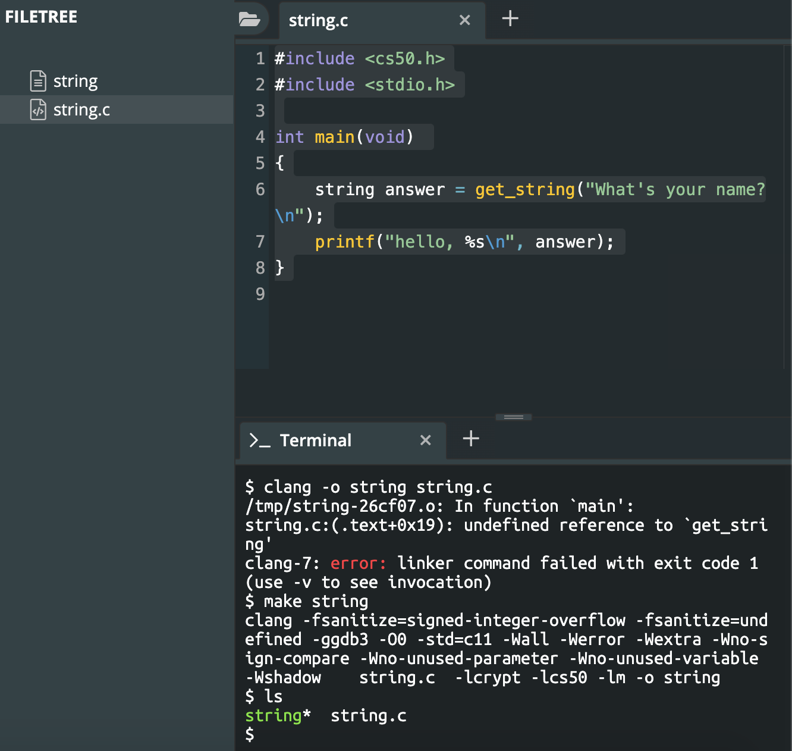
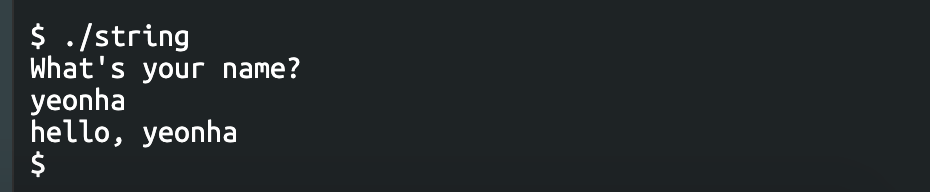

### 입문

CS50에서 제공하는 샌드박스([sandbox.cs50.io](http://sandbox.cs50.io/))에서 C언어를 간단히 작성해볼 수 있다.

파일을 하나 생성하여 hello.c라고 명명하고 그 안에 다음과 같은 내용을 작성한다.

```c
#include <stdio.h>

int main(void) {
    printf("Hello, world");
}
```

대략 Hello, world라는 인삿말을 출력하라는 내용이다. 이를 실행하려면 우선 사람의 언어(영어)로 비스무리하게 작성된 것 같은 **C언어를 컴퓨터가 이해할 수 있는 이진법으로 컴파일 하는 과정**을 거쳐야 한다.

<p align="center"></p>

여기서 소스 코드는 C, 파이선, 자바, C++같이 한번쯤 들어봤음직한 프로그래밍 언어이며, 머신 코드는 0과 1로 작성된 컴퓨터가 이해할 수 있는 코드이다. 그리고 **소스코드를 머신 코드로 변환시켜주는 역할을 하는 것이 컴파일러이다.**

C언어에서 컴파일러를 실행하는 명령어는 `clang` 인데,

터미널에서 `clang hello.c` 를 입력하면 같은 폴더 밑에 `a.out` 이라는 새로운 파일이 생긴 것을 확인할 수 있다. (a.out은 Assembly Output-어셈블리 출력-을 의미한다)

머신코드로 컴파일된 a.out를 실행하면 비로소 원하는 결과물을 얻을 수 있다.

<p align="center"></p>

덧붙여 clang 명령어에서는 출력과 관련한 인자로 `-o` 를 사용할 수 있으며, 컴파일되는 파일명을 지정가능하다.

```bash
clang -o hello hello.c
```

### 문자열(String)

```c
#include <cs50.h>
#include <stdio.h>

int main(void)
{
    string answer = get_string("What's your name?\n");
    printf("hello, %s\n", answer);
}
```

위는 컴퓨터가 What's your name?이라는 질문을 했을 때 사용자가 답변한 내용을 출력하는 예제이다.

string은 문자열을 뜻하며, answer라는 변수에 문자열을 담고 싶다면 위처럼 `string 변수이름` 형식을 사용한다.

출력되는 문자열에 변수 이름을 넣으려면 문자열에 해당하는 형식지정자(placeholder)인 `%s` 를 사용하면 되는데, `%s` 자리에 사용자가 입력하는 `answer` 값이 대입된다.

이제 아래 명령어를 입력하여 파일을 컴파일한다.

```bash
clang -o string string.c -lcs50
```

끝에 있는 `-lcs50` 라는 옵션은 cs50라는 라이브러리를 연결하라는 의미이다.(`-l` 은 연결하라는 의미) 위 코드에 쓰인 `string` , `get_string` 같은 변수와 함수를 사용하기 위해선 cs50 라이브러리를 연결시켜야 하기 때문이다.

위 명령어로 파일을 소스코드를 컴파일할 수도 있고, 아래처럼 간단하게 리눅스에 탑재되어 있는 `make` 명령어를 이용해 손쉽게 컴파일하는 방법도 있다.

```bash
make string
```

그러면 놀랍게도 string이라는 컴파일된 파일이 만들어지게(made!) 된다.

<p></p>

`make`라는 명령어는 알아서(!) 어떤 파일을 생성해야 하는지, 어떤 옵션 인자를 덧붙여야 하는지 등을 찾아서 어떤 프로그램을 만들어야 하는지 찾아낸다.

<p align="center"></p>


### 자료형, 형식 지정자

**자료형**

- char: 한 개의 문자
- bool: 참/거짓(true/false)
- double: 소숫점 뒤에 더 많은 숫자를 넣을 수 있음. 소숫점 이하 15자리까지 표기
- float: 실수, 소숫점 이하 6자리까지 표기
- int: 숫자이지만 일반적으로 특정 크기를 가짐. 일반적으로 40억 까지 셀 수 있음
- long: int 보다 더 넓은 범위의 숫자까지 셀 수 있음
- string: 문자열

**형식 지정자(Placeholder)**

- %c : char
- %f: float, double
- %i: int
- %li: long
- %s: string

다음은 %f 형식 지정자가 사용되는 예제이다.

```c
#include <cs50.h>
#include <stdio.h>

int main(void)
{
    float price = get_float("What's the price?\n");
    printf("Your total is %f. \n", price * 1.1);
}
```

```bash
$ ./float
What's the price?
10000
Your total is 11000.000000.
```

이렇게 소수점이 5자리가 나오는데, 소숫점을 없애고 싶다면 아래처럼 수정하면 된다.

```c
#include <cs50.h>
#include <stdio.h>

int main(void)
{
    float price = get_float("What's the price?\n");
    printf("Your total is %.0f. \n", price * 1.1);
}
```

```bash
What's the price?
10000
Your total is 11000.
```

### 사용자 정의 함수, 중첩 Loop, do-while Loop

**사용자 정의 함수**

C는 프로그래밍 코드를 위에서 아래 방향으로 실행한다. 따라서 `int main(void)` 함수를 가장 상위에 정의하고 그 아래에 호출되는 다른 함수를 넣게 되면 터미널은 에러를 뱉는다.

```c
#include <cs50.h>
#include <stdio.h>

int main(void)
{
    int repeatNum = get_int("Repeat for:");
    cough(repeatNum); // Error!
}

void cough(int repeat) {
    for (int i = 0; i < repeat; i++) {
        printf("cough\n");
    }
}
```

호출되는 구간보다 함수가 정의된 구간이 아래에 있는 경우, 사용자 정의 함수를 이용하면 그런 에러를 방지할 수 있다.

```c
#include <cs50.h>
#include <stdio.h>

void cough(int repeat);

int main(void)
{
    int repeatNum = get_int("Repeat for:");
    cough(repeatNum);
}

void cough(int repeat) {
    for (int i = 0; i < repeat; i++) {
        printf("cough\n");
    }
}
```

**중첩 loop**

```c
#include <cs50.h>
#include <stdio.h>

int main(void)
{
    int n;
    do
    {
        n = get_int("Width: ");
    }
    while (n < 1);
    for (int i = 0; i < n; i++) {
        for (int j = 0; j < n; j++) {
            printf("#");
        }
        printf("\n");
    }
}
```

위 함수를 실행하면 다음과 같이 2차원의 #배열이 프린트되는 것을 확인할 수 있다.

```bash
$ ./mario
Width: 4
####
####
####
####
```

**do-while loop**

아래 예제에서는 `get_positive_int`라는 함수를 새로 생성해주었다. 이 함수는 인자 값을 받지 않고(void) 정수형을 리턴한다(int). 그리고 do-while loop가 쓰였는데 이는 while (조건) 동안 do (어떤것)을 하라는 의미이다. 그러니까 아래의 코드는 n이 1보다 작다면 get_int함수로 새 정수를 계속해서 받고, while문에서 벗어나는 조건인 경우 n에 해당하는 변수값을 그대로 리턴하라는 뜻이다.

do-while loop의 특징은 조건을 먼저 거치지 않고 먼저 do 에 해당하는 로직을 무조건 한 번 수행한 뒤 while에 해당하는 조건을 검사한다는 데에 있다.

```c
#include <cs50.h>
#include <stdio.h>

int get_positive_int(void);

int main(void)
{
    int i = get_positive_int();
    printf("%i\n", i);
}

int get_positive_int(void)
{
    int n;
    do
    {
        n = get_int("Positive integer: ");
    }
    while (n < 1);
    return n;
}

```

### 하드웨어의 한계

컴퓨터는 RAM(Random Access Memory)라는 물리적 저장자치를 갖고 있다. 이 RAM에서 프로그램들이 실행중에 저장된다. 컴퓨터가 동시에 여러 태스크를 처리할 때 사용되는 부품이다. 그러나 이는 하드웨어기 때문에 그 성능에는 한계가 있다. 즉 컴퓨터가 할 수 있는 연산에는 한계가 있다. 아래 예제를 통해 살펴보자.

**부동 소수점 부정확성**

```c
#include <stdio.h>
#include <cs50.h>

int main(void)
{
  float x = get_float("x: ");
  float y = get_float("y: ");

  printf("x / y = %.10f\n", x / y);
}
```

실행 결과

```bash
x: 1
y: 10
x / y = 0.1000000015
```

0.1000000015이라는 요상한 숫자가 나왔다. 1 나누기 10은 0.1이 아니었던가? 왜 이런 결과가 나온 것일까?

메모리 저장 공간이 유한하기 때문에 컴퓨터는 연산 과정 중 한계에 부딪힌다. 컴퓨터는 계산할 수 있는 값들 중 1/10과 가장 가까운 값을 저장한다. 유한한 정보를 사용해서는 무한한 숫자들을 100% 정확하게 저장할 수 없기 때문이다. 이를 **부동소수점 부정확성**이라고 한다.

**오버플로우**

```c
#include <stdio.h>
#include <unistd.h>

int main(void)
{
    for (int i = 1; i *=2;) {
        printf("%i\n", i);
        sleep(1);
    }
}
```

위 코드를 실행하다보면 어느순간 다음 에러 메시지를 맞닥뜨리게 될 것이다.

```bash
67108864
134217728
268435456
536870912
1073741824
overflow.c:7:23: runtime error: signed integer overflow: 1073741824 * 2 cannot be represented in type 'int'
-2147483648
```

계속해서 숫자를 키워나가다보면 어느 순간 해당 숫자를 표현하기 위한 비트가 한계에 부딪히게 된다. 즉 더 큰 값을 저장할수가 없다. 숫자가 10어억을 넘기자 앞으로 넘어갈 1의 자리가 없어졌고 int에서는 32개의 비트가 한계이기 때문에 그 이상의 숫자는 저장할 수 없다.

오버플로우로 인한 아주 유명하고 친숙한 문제가 90년대 후반 우려되었던 Y2K이다. 연도를 마지막 두 자릿수로 저장하던 관습 때문에 밀레니엄이 오면 99에서 00으로 정수 오버플로우가 발생하고, 이 때문에 전세계 전산 시스템에 혼란이 도래한다는 이슈였다. 세계는 이 문제를 방지하기 위해 수백만 달러를 투자해서 프로그래머들에게 더 많은 메모리를 이용해 이를 해결하도록 했고 많은 이들이 우려하던 상황을 막을 수 있었다.
