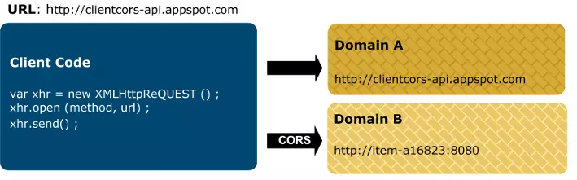
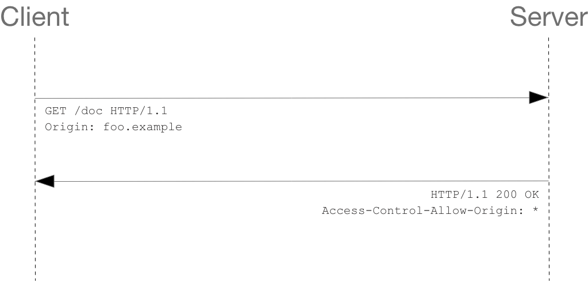

CORS는 Cross—Origin Resource Sharing(교차 출처 리소스 공유)의 약자이다. 브라우저는 보안상의 이유로 웹 애플리케이션이 리소스를 요청할 때 자신의 출처와 동일한 출처의 리소스만 허락한다. 

<p align="center"></p>
<figcaption align="center">
<small>
https://docs.oracle.com/cd/E65459_01/dev.1112/e65461/content/general_cors.html
</small>
</figcaption>


즉, https://www.domain-a.com 도메인이 하는 요청이 https://www.domain-a.com 도메인이어야만 바라는 응답을 받을 수 있다는 이야기다. 
하지만 대부분의 클라이언트-서버 요청은 클라이언트와 서버의 URL이 다르다! 그럼 어떻게 서로 다른 도메인간의 통신이 가능한걸까?


서버에서 응답으로 보내는 HTTP 헤더에 CORS 헤더를 설정해주면 다른 출처의 리소스도 불러올 수 있기 때문이다. CORS는 이렇듯 HTTP 헤더를 기반으로 <b>동일한 출처가 아닌 서버의 자원에 접근을 가능케하는 메커니즘</b>이다.

애플리케이션 측에서 서버에 API 요청을 보낼 때 요청 헤더의 `Origin` 이라는 필드에 요청을 보내는 출처를 담아 보낸다. 

```js
Origin: https://yeonhapark.github.io
```

이를 받으면 서버는 `Access-Control-Allow-Origin` 헤더에 `Origin`을 명시해서 브라우저에게 응답한다. 서버가 `Access-Control-Allow-Origin`에 담는 내용은 반드시 클라이언트 측에서 보내진 `Origin`일 필요는 없고, 리소스에 접근이 허용된 출처를 명시해주면 된다. 이 응답을 받으면 브라우저는 자신이 보냈던 요청의 `Origin` 과 서버가 보내준 응답의 `Access-Control-Allow-Origin` 을 비교해본 후 응답이 유효한 응답인지 아닌지를 결정한다.


기본적인 작동 방식은 위와 같지만 정확히 어떤 것이 잘못되었는지 알려면 아래의 세 가지 시나리오에 대해 알아두는 것이 좋다.

### Simple Request(단순 요청)

다음 조건을 모두 충족하는 요청이 simple requests이다.

- `GET` , `HEAD`, `POST` 중 하나의 메서드
- 유저 에이전트가 자동으로 설정한 헤더 외에 사용가능한 헤더는 오직 `Accept` , `Accept-Language` , `Content-Language`, `Content-Type` 이다.
- `Content-Type` 에 넣을 수 있는 헤더는 오직 `application/x-www-form-urlencoded` , `multipart/form-data`, `text/plain` 이다.

<p align="center"></p>
<figcaption align="center">
<small>
https://developer.mozilla.org/en-US/docs/Web/HTTP/CORS
</small>
</figcaption>


```
GET /resources/public-data/ HTTP/1.1
Host: bar.other
User-Agent: Mozilla/5.0 (Macintosh; Intel Mac OS X 10.14; rv:71.0) Gecko/20100101 Firefox/71.0
Accept: text/html,application/xhtml+xml,application/xml;q=0.9,*/*;q=0.8
Accept-Language: en-us,en;q=0.5
Accept-Encoding: gzip,deflate
Connection: keep-alive
Origin: https://foo.example
```

```jsx
HTTP/1.1 200 OK
Date: Mon, 01 Dec 2008 00:23:53 GMT
Server: Apache/2
Access-Control-Allow-Origin: https://foo.example
Keep-Alive: timeout=2, max=100
Connection: Keep-Alive
Transfer-Encoding: chunked
Content-Type: application/xml

[…XML Data…]
```

서버의 응답은 `https://foo.example` 에서의 요청에 대해서만 리소스를 제공할 것을 명시하고 있다.

### Preflight Request(프리플라이트 요청)

프리플라이트 요청은 브라우저가 `OPTIONS` 메서드를 사용하여 먼저 HTTP 요청을 다른 출처의 리소스에 보내어 실 요청을 보내기에 안전한지 판단하는 방법이다. 이 방법은 요청이 유저 데이터에 사이드 이펙트를 끼칠 수 있기 때문에 선택된다.

```jsx
const xhr = new XMLHttpRequest();
xhr.open('POST', 'https://bar.other/resources/post-here/');
xhr.setRequestHeader('X-PINGOTHER', 'pingpong');
xhr.setRequestHeader('Content-Type', 'application/xml');
xhr.onreadystatechange = handler;
xhr.send('<person><name>Arun</name></person>');
```

위의 요청은 스탠다드에서 벗어난 HTTP 요청 헤더인 `X-PINGOTHER` 가 사용되었고 `Content-Type` 도 `application/xml` 이다. 따라서  프리플라이트 요청이 된다.

```
OPTIONS /doc HTTP/1.1
Host: bar.other
User-Agent: Mozilla/5.0 (Macintosh; Intel Mac OS X 10.14; rv:71.0) Gecko/20100101 Firefox/71.0
Accept: text/html,application/xhtml+xml,application/xml;q=0.9,*/*;q=0.8
Accept-Language: en-us,en;q=0.5
Accept-Encoding: gzip,deflate
Connection: keep-alive
Origin: https://foo.example
Access-Control-Request-Method: POST
Access-Control-Request-Headers: X-PINGOTHER, Content-Type

HTTP/1.1 204 No Content
Date: Mon, 01 Dec 2008 01:15:39 GMT
Server: Apache/2
Access-Control-Allow-Origin: https://foo.example
Access-Control-Allow-Methods: POST, GET, OPTIONS
Access-Control-Allow-Headers: X-PINGOTHER, Content-Type
Access-Control-Max-Age: 86400
Vary: Accept-Encoding, Origin
Keep-Alive: timeout=2, max=100
Connection: Keep-Alive
```

1번줄~10번줄 까지는 `OPTIONS` 메서드 플리플라이트 요청을 나타낸다. 브라우저는 자바스크립트 코드에 있는 요청 파라미터를 바탕으로 `OPTIONS` 메서드가 사용되어야하는지를 판단한다. `OPTIONS` 요청은 9번줄~10번줄에 해당하는 두 요청헤더가 추가된다.

```jsx
Access-Control-Request-Method: POST
Access-Control-Request-Headers: X-PINGOTHER, Content-Type
```

``Access-Control-Request-Method` 는 실제 리퀘스트가 보내질 경우 `POST` 메서드로 가게됨을 서버에 알린다. `Access-Control-Request-Headers` 는 실제 리퀘스트가 `X-PINGOTHER` 그리고 `Content-Type` 헤더를 포함함을 가리킨다. 이런 정보로 헤더는 어떤 요청을 받아들여야  하는 지에 대한 정보를 얻는다.

13줄 부터 22줄까지는 서버에서 보내는 응답이다. 요청 메서드(`POST` )와 헤더가 허용됨을 알려준다. 

```jsx
Access-Control-Allow-Origin: https://foo.example
Access-Control-Allow-Methods: POST, GET, OPTIONS
Access-Control-Allow-Headers: X-PINGOTHER, Content-Type
Access-Control-Max-Age: 86400
```

`Access-Control-Allow-Origin: https://foo.example` 은 요청을 하는 도메인만 오직 리소스에 접근이 가능함을 나타낸다. `Access-Control-Allow-Methods` 은 `POST` , `GET` 메서드가 리소스 요청에 사용될 수 있음을 가리킨다.

또한 `Access-Control-Allow-Header` 를 통해 실제 리퀘스트에 사용이 가능한 헤더 정보를 보내준다. `Access-Control-Max-Age: 86400` 는 프리플라이트 요청이 얼마간 캐시될 수 있는지를 나타낸다. 위 경우의 시간은 86400초, 즉 24시간이다. 

프리플라이트 요청이 끝나면 진짜 요청이 보내진다.

```
POST /doc HTTP/1.1
Host: bar.other
User-Agent: Mozilla/5.0 (Macintosh; Intel Mac OS X 10.14; rv:71.0) Gecko/20100101 Firefox/71.0
Accept: text/html,application/xhtml+xml,application/xml;q=0.9,*/*;q=0.8
Accept-Language: en-us,en;q=0.5
Accept-Encoding: gzip,deflate
Connection: keep-alive
X-PINGOTHER: pingpong
Content-Type: text/xml; charset=UTF-8
Referer: https://foo.example/examples/preflightInvocation.html
Content-Length: 55
Origin: https://foo.example
Pragma: no-cache
Cache-Control: no-cache

<person><name>Arun</name></person>

HTTP/1.1 200 OK
Date: Mon, 01 Dec 2008 01:15:40 GMT
Server: Apache/2
Access-Control-Allow-Origin: https://foo.example
Vary: Accept-Encoding, Origin
Content-Encoding: gzip
Content-Length: 235
Keep-Alive: timeout=2, max=99
Connection: Keep-Alive
Content-Type: text/plain

[Some XML payload]
```
<p align="center"></p>
<figcaption align="center">
<small>
https://developer.mozilla.org/en-US/docs/Web/HTTP/CORS
</small>
</figcaption>


### Requests with Credentials(인증된 요청)

기본적으로 크로스 사이트 `XMLHttpRequest` 나 `Fetch` API는  크레덴셜을 보내지 않는다. 인증과 관련된 정보를 담으려면 `credentials` 옵션을 사용한다.

옵션에는 세 가지 값을 사용할 수 있다.

- `same-origin`: 같은 출처 간 요청에만 인증 정보를 담을 수 있다.
- `include`: 모든 요청에 인증 정보를 담을 수 있다.
- `omit`: 모든 요청에 인증 정보를 담지 않는다.

다만 브라우저는 인증 모드가 `include` 일 경우 `Access-Control-Allow-Origin` 값에 와일드카드(*) 사용을 금하고 있다. 이 경우에는 응답에 `Allow-Control-Allow-Credentials: true` 를 넣어주면 복잡한 상황을 방지할 수 있다.

### CORS를 해결하기 위한 방법

서버 측에서 브라우저에서 정보를 읽는 것이 허용된 출처를 명시해주어야 하기 때문에 서버 측에서 HTTP 헤더를 추가해주어야 한다(아래 그림 참조)

<p align="center"></p>
<figcaption align="center">
<small>
https://developer.mozilla.org/en-US/docs/Web/HTTP/CORS
</small>
</figcaption>


CORS에러를 맞닦뜨리는 쪽은 요청을 담당하는 프론트엔드 개발자지만 CORS 에러를 해결하는 쪽은 서버를 담당하는 백엔드 개발자이다. 따라서 프론트 개발자는 백엔드 개발자에게 CORS를 해결하기 위한 헤더를 추가해달라고 요청하고, 백엔드 개발자는 이에 대응하여 에러를 처리한다.

로컬 서버에 한정적인 방법이지만, 프론트 개발자 측에서 CORS를 해결하는 방법도 있다.

`http-proxy-middleware` 라는 패키지를 추가하면 프론트에서 요청을 보내는 주소를 proxy 우회하여 요청을 받는 서버와 동일하게 조정하여 CORS를 방지하는 방법이다.

```jsx
const { createProxyMiddleware } = require("http-proxy-middleware");
module.exports = function (app) {
  app.use(
    ["/api", "/auth/google"],
    createProxyMiddleware({
      target: "http://localhost:5000",
    })
  );
};
```

참고한 글
- https://evan-moon.github.io/2020/05/21/about-cors/#credentialed-request
- https://developer.mozilla.org/en-US/docs/Web/HTTP/CORS